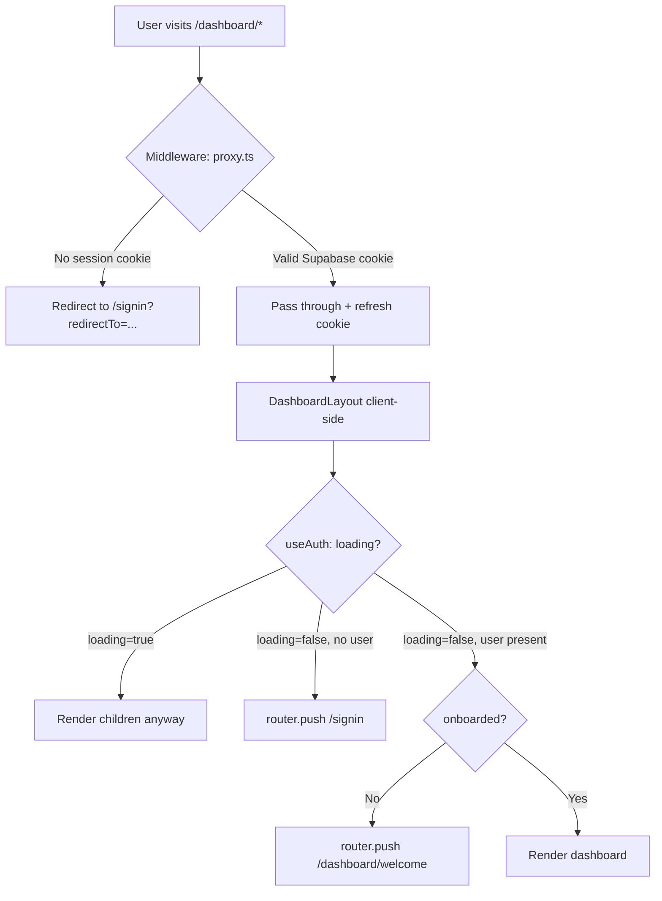

# Anuvaad — Complete Build Verification & Audit Report

> **Audit Date:** 2026-06-11  
> **Auditor:** Antigravity AI (Claude Sonnet 4.6 Thinking)  
> **Scope:** Full-stack codebase — Frontend (Next.js 16), Backend (FastAPI), Infrastructure, Security, Testing  
> **Project Version:** 0.1.0 (frontend) / Build-in-Progress  

---

## Executive Summary

The Anuvaad codebase is a **production-grade AI code translator** built on a modern stack: **Next.js 16 + React 19** (frontend), **FastAPI + Python** (backend), **Supabase** (auth + database), **Redis/Upstash** (caching), and **Razorpay** (billing). The build is functionally solid and exhibits several engineering best practices including streaming SSE, adaptive quota protection, and CI-friendly middleware mocking.

However, the audit found **9 High**, **14 Medium**, and **8 Low** severity issues spanning security, architecture, and code quality. The most critical findings concern a hardcoded Supabase anon key in a committed `.env.local` file and an inconsistently applied authentication bypass pattern that reduces testability auditability.

---

## Severity Legend

| Rating | Meaning |
|--------|---------|
| 🔴 **HIGH** | Security risk, data integrity issue, or production-blocker |
| 🟡 **MEDIUM** | Technical debt, reliability concern, or architectural smell |
| 🟢 **LOW** | Code quality, maintainability, or DX improvement |

---

## 1. Security Audit

### 1.1 Secret Exposure

| # | Finding | File | Severity |
|---|---------|------|----------|
| SEC-01 | **Committed Supabase anon key** in `.env.local`. The key `eyJhbGci…` is a real production JWT token committed to version control. | `frontend/.env.local:6` | 🔴 HIGH |
| SEC-02 | **Committed Supabase Project URL** in `.env.local` (`lbqgvehjtbfkxawbznwd.supabase.co`). Even if the anon key is rotated, the project ID is permanently exposed. | `frontend/.env.local:5` | 🔴 HIGH |

> [!CAUTION]
> **SEC-01 is a critical exposure.** The Supabase anon key in `.env.local` must be rotated immediately in the Supabase Dashboard (Settings → API → Rotate anon key). `.env.local` must be added to `.gitignore` if not already present.

---

### 1.2 CSRF & Origin Validation

| # | Finding | File | Severity |
|---|---------|------|----------|
| SEC-03 | `csrf_origin_middleware` reads `FRONTEND_URL` and `IS_PRODUCTION` from `sys.modules["main"]` using dynamic attribute lookups. This pattern is fragile, hard to audit, and can be silently bypassed if module names change. | `app/main.py:88-130` | 🟡 MEDIUM |
| SEC-04 | **CSRF bypass for webhooks**: `/api/webhook/` paths are entirely excluded from CSRF origin validation. Ensure Razorpay signature verification (`verify_webhook_signature`) is always called before accessing the payload — this is correctly implemented. | `app/main.py:105` | 🟢 LOW |

---

### 1.3 Input Sanitisation

| # | Finding | File | Severity |
|---|---------|------|----------|
| SEC-05 | Prompt injection sanitisation in `sanitise_input()` uses regex only. Patterns miss Unicode obfuscation, RTL text injection, and zero-width character attacks — all common prompt-injection vectors. | `app/routers/translate.py:24-42` | 🟡 MEDIUM |
| SEC-06 | The `/api/english-to-code` endpoint calls `enforce_quotas_and_protection` but **does not call `sanitise_input()`** on `payload.modified_english` or `payload.full_context`. | `app/routers/translate.py:501-532` | 🔴 HIGH |
| SEC-07 | The `/api/sync-english-to-code` endpoint does **not call `sanitise_input()`** on any block `english_translation` field before constructing an LLM prompt. | `app/routers/translate.py:535-613` | 🔴 HIGH |

---

### 1.4 Rate Limiting

| # | Finding | File | Severity |
|---|---------|------|----------|
| SEC-08 | Localhost IPs (`127.0.0.1`) are **exempt from rate limiting** globally: `if client_ip == "127.0.0.1": return await call_next(request)`. This is a deployment risk if the backend is ever proxied in a way that leaks internal IPs as client IPs. | `app/main.py:169-170` | 🟡 MEDIUM |
| SEC-09 | Rate limit counters are stored in Redis/LRU with SHA-256 of the bearer token. If Redis is unavailable, `cache.incr_rate_limit()` falls back to an in-memory LRU — this means rate limits are **per-process only**, not cluster-wide on Redis failure. | `app/main.py:160-207` | 🟡 MEDIUM |

---

### 1.5 Frontend Security

| # | Finding | File | Severity |
|---|---------|------|----------|
| SEC-10 | `redirect` in the sign-in form uses `window.location.href` after validating the path starts with `/`. This guards against open redirects but uses `setTimeout(500)` — any network lag could leave the user on an error state. Prefer `router.push(redirectTo)` from Next.js. | `app/signin/page.tsx:164-166` | 🟢 LOW |
| SEC-11 | The honeypot field in the sign-in form uses `aria-hidden="true"` but the div has `absolute overflow-hidden h-0 w-0 -z-50 opacity-0`. This is visually hidden but the field is still in the DOM — screen readers with JS-based forms may interact with it. Use `tabIndex={-1}` + `autoComplete="off"` (already done) but also add `role="none"` to the wrapper. | `app/signin/page.tsx:267-276` | 🟢 LOW |

---

## 2. Architecture & Code Quality

### 2.1 Backend Architecture

| # | Finding | File | Severity |
|---|---------|------|----------|
| ARCH-01 | **`sys.modules` monkey-patching pattern** is used extensively across `quota.py`, `auth.py`, and `billing.py` to allow test mocking. This anti-pattern (`main_mod = sys.modules.get("main")`) makes production code harder to read and creates implicit coupling to the module name. Consider dependency injection or a proper configuration layer. | `app/core/quota.py:30-39, 154-162`, `app/core/auth.py:59-68` | 🟡 MEDIUM |
| ARCH-02 | `save_translation_background` runs DB pruning, history writes, and cache invalidation **synchronously within a background task** but calls `supabase_request_list` which does a full row fetch of all user history to count rows. For users with 1000 records (Pro limit), this is an O(N) operation on every translation. | `app/core/quota.py:78-83` | 🟡 MEDIUM |
| ARCH-03 | `is_token_pro()` in `auth.py` creates a **new `httpx.AsyncClient()` instance per call** (line 106) rather than using the shared `get_http_client()` singleton. This creates a connection per request surge. | `app/core/auth.py:106` | 🟡 MEDIUM |
| ARCH-04 | `get_user_pro_status()` also uses `sys.modules` patching but in production calls `supabase_request`. The Pro status cache TTL is **5 minutes** (`ttl=300`). If a user upgrades, they remain on Free tier in the cache for up to 5 minutes. This can cause failed Pro actions immediately after payment. | `app/core/auth.py:97` | 🟡 MEDIUM |
| ARCH-05 | The `_global_http_client` in `config.py` is initialised lazily with a bare Python `None` assignment. Under high concurrency, multiple coroutines could see `None` simultaneously and race to create the client. Use an `asyncio.Lock` for thread-safe singleton creation. | `app/core/config.py:43-52` | 🟡 MEDIUM |

---

### 2.2 Frontend Architecture

| # | Finding | File | Severity |
|---|---------|------|----------|
| ARCH-06 | **`WorkspaceProvider` is mounted twice**: once in `app/layout.tsx` (line 9 + 129) and once in `dashboard/layout.tsx` (line 229). This creates duplicate context trees, which may cause stale context reads on dashboard routes. | `frontend/src/app/layout.tsx:9`, `frontend/src/app/dashboard/layout.tsx:229` | 🔴 HIGH |
| ARCH-07 | The `DashboardLayout` (`dashboard/layout.tsx`) **redundantly checks auth** via `useEffect` (line 112-115) even though the middleware (`proxy.ts`) already enforces auth at the edge. This causes a flash-of-unauthenticated-content (FOUC) before the client-side redirect. | `frontend/src/app/dashboard/layout.tsx:112-115` | 🟡 MEDIUM |
| ARCH-08 | `translate/page.tsx` is **1,454 lines** — a massive monolithic client component that combines state management, API calls, drag-and-drop, streaming SSE, Monaco editors, and UI rendering. This should be decomposed into feature sub-components. | `frontend/src/app/dashboard/translate/page.tsx` | 🟡 MEDIUM |
| ARCH-09 | `useTranslationStats` in `hooks.ts` accepts `_userEmail` (unused — prefixed with `_`) but uses only `accessToken`. The parameter is misleading and should be removed from the hook signature. | `frontend/src/lib/hooks.ts:46` | 🟢 LOW |
| ARCH-10 | In the translate page, history loading uses `fetch` inside a `useEffect` with no loading state or error boundary — if the history endpoint fails, the user sees a silent console error. | `frontend/src/app/dashboard/translate/page.tsx:486-506` | 🟢 LOW |

---

### 2.3 Configuration & Environment

| # | Finding | File | Severity |
|---|---------|------|----------|
| ARCH-11 | **`next.config.ts` mixes ESM and CJS**: uses `import` statements but wraps them with `withBundleAnalyzer` and `withPWA` in a pattern that may produce subtle order-of-operation issues. The `configWithPWA` → `withSentryConfig` → `analyze()` chain is correct but all three wrappers modify `webpackConfig`, creating potential conflicts with Tailwind v4's PostCSS pipeline. | `frontend/next.config.ts:42-48` | 🟢 LOW |
| ARCH-12 | `NEXT_PUBLIC_LANDING_V2=true` is set in `.env.local`, enabling a feature-flagged landing page (`LandingExperience`). The `false` branch (original landing) still imports `WebGLScrollProvider` and multiple heavy landing components — these are bundled even when the flag is `true`. | `frontend/src/app/page.tsx:52-124` | 🟡 MEDIUM |

---

## 3. Performance Analysis

### 3.1 Frontend Performance

| # | Finding | Details | Severity |
|---|---------|---------|----------|
| PERF-01 | **Monaco Editor loaded synchronously in SSR context** despite `ssr: false` dynamic import. The `Skeleton` fallback placeholder is correct, but both `Editor` and `DiffEditor` are imported in the same component tree, doubling the Monaco load surface. | `translate/page.tsx:11-18` | 🟡 MEDIUM |
| PERF-02 | **rAF-buffered streaming** is correctly implemented for SSE rendering. The `requestAnimationFrame` flush pattern prevents per-chunk React re-renders. ✅ | `translate/page.tsx:603-613` | N/A |
| PERF-03 | `useTranslationStats` sets `dedupingInterval: 30000` and `revalidateOnFocus: false` on SWR. After a translation, `mutate()` is called to force revalidation. This is correct and efficient. ✅ | `hooks.ts:51`, `translate/page.tsx:699-702` | N/A |
| PERF-04 | The landing page imports `three.js` (WebGL), `framer-motion`, `gsap`, and multiple landing sections even when `NEXT_PUBLIC_LANDING_V2=true` skips the V1 landing entirely. Conditional dynamic imports should be used. | `frontend/src/app/page.tsx` | 🟡 MEDIUM |
| PERF-05 | **Three.js** (`@types/three: ^0.184.1`) is in `dependencies` (not `devDependencies`), which means the `@types` package ships in the production bundle unnecessarily. | `frontend/package.json:20` | 🟢 LOW |

### 3.2 Backend Performance

| # | Finding | Details | Severity |
|---|---------|---------|----------|
| PERF-06 | History pruning in `save_translation_background` fetches **all history rows** to count them, then deletes the oldest. For Pro users with 1,000 records, this is a full table scan on every translation save. Use a `COUNT(*)` query and delete by OFFSET instead. | `app/core/quota.py:78-120` | 🟡 MEDIUM |
| PERF-07 | Cache TTL for translation results is **7 days** (`86400 * 7`). For code that changes (e.g., library APIs), stale cached translations may return incorrect results without the user knowing. Consider adding a cache version or shorter TTL for `code-to-code` mode. | `app/routers/translate.py:194, 330, 446` | 🟢 LOW |
| PERF-08 | `get_lifetime_translations` is cached for only **60 seconds** per user but is called on every `save_translation_background` call for milestone checks. This creates N+1 cache reads. | `app/core/quota.py:215-239` | 🟢 LOW |

---

## 4. Testing Coverage

### 4.1 Backend Tests

| Test File | Coverage Area | Status |
|-----------|--------------|--------|
| `test_api.py` | Core API endpoints | ✅ Present |
| `test_cache.py` | Redis/LRU cache operations | ✅ Present |
| `test_comprehensive.py` | Full workflow scenarios | ✅ Present |
| `test_security.py` | Auth, CSRF, rate limiting | ✅ Present |
| `test_streaming.py` | SSE streaming behaviour | ✅ Present |
| `test_validation.py` | Input validation / prompt injection | ✅ Present |
| `test_production.py` | Production mode checks | ✅ Present |
| `test_launch_resilience.py` | Redis down / degraded mode | ✅ Present |
| `test_router.py` | Router-level tests | ✅ Present |

**Backend test gaps:**
- ❌ No test for `save_translation_background` history pruning logic  
- ❌ No test for `is_token_pro()` connection pooling  
- ❌ No test for the `english-to-code` + `sync-english-to-code` missing sanitisation (SEC-06, SEC-07)  
- ❌ No test for `deduct_credit` race condition in concurrent requests

### 4.2 Frontend Tests (E2E — Playwright)

| # | Finding | File | Severity |
|---|---------|------|----------|
| TEST-01 | Auth setup (`auth.setup.ts`) imports `mockSupabaseAuth` from `./mock-auth`, but this file was not found in the `e2e/` directory listing. If the file is missing, **all E2E tests will fail** at the setup phase. | `frontend/e2e/auth.setup.ts:3` | 🔴 HIGH |
| TEST-02 | E2E tests are configured for **Chromium only**. Firefox and Safari (WebKit) are not included in the test matrix, missing cross-browser regressions. | `frontend/playwright.config.ts:41-46` | 🟡 MEDIUM |
| TEST-03 | The E2E auth setup attempts self-healing signup but the signup flow (`/signup`) clicks `button[type="submit"]` without waiting for the email confirmation flow. If Supabase email confirmation is enabled in production, this test will hang. | `frontend/e2e/auth.setup.ts:37-41` | 🟡 MEDIUM |
| TEST-04 | No unit tests exist for React components (no Jest/Vitest setup found). Critical components like `AuthProvider`, `useAuth`, `WorkspaceContext`, and the streaming translate page have no isolation tests. | `frontend/` | 🟡 MEDIUM |

---

## 5. Infrastructure & Deployment

### 5.1 Docker & Compose

| # | Finding | File | Severity |
|---|---------|------|----------|
| INFRA-01 | The `docker-compose.yml` frontend container sets `NEXT_PUBLIC_API_URL=http://backend:8000`. This is an internal Docker network URL. If HTTPS is terminated at nginx, requests from the Next.js backend to the FastAPI backend will be HTTP, which is correct for internal traffic — but this URL must **never** be exposed to client-side code in production. | `docker-compose.yml:42` | 🟡 MEDIUM |
| INFRA-02 | The `nginx` service in `docker-compose.yml` has no health check defined. If nginx fails to start (port conflict, config error), dependent services may appear healthy while the proxy is down. | `docker-compose.yml:48-57` | 🟢 LOW |
| INFRA-03 | The backend `Dockerfile` is at the root but the frontend `Dockerfile` is in `./frontend`. The root `docker-compose.yml` references both. If someone runs `docker build .` at the root, they'll get the backend image — the naming is unambiguous but could be clearer with a `docker-compose.override.yml`. | `docker-compose.yml:17, 36-38` | 🟢 LOW |
| INFRA-04 | Redis container uses `redis:7-alpine` with no authentication configured (no `requirepass`). In production, expose Redis only on the Docker internal network and never on public ports. | `docker-compose.yml:3-14` | 🟡 MEDIUM |

### 5.2 Next.js Build Configuration

| # | Finding | File | Severity |
|---|---------|------|----------|
| INFRA-05 | `output: "standalone"` is set, which is correct for Docker deployments. However, the Sentry `tunnelRoute: "/monitoring"` conflicts with the `/api/:path*` rewrite rule if monitoring traffic is proxied through the backend. | `next.config.ts:44-48` | 🟡 MEDIUM |
| INFRA-06 | `experimental.optimizeCss: true` is enabled. This uses `critters` for CSS inlining, which may interact poorly with Tailwind v4's JIT engine and the design system token imports (`@import "tailwindcss"`). Monitor for missing critical CSS in production builds. | `next.config.ts:19` | 🟢 LOW |
| INFRA-07 | `package.json` uses `"next": "^16.2.7"` (caret — allow minor updates). This is appropriate but the `eslint-config-next` is pinned to `16.2.4` — a version mismatch could cause lint failures after a `next` patch update. | `frontend/package.json:50` | 🟢 LOW |

---

## 6. Design System Integrity

| # | Finding | File | Severity |
|---|---------|------|----------|
| DS-01 | `globals.css` imports `shadcn/tailwind.css` but `components.json` and the design system are based on Tailwind v4. The `@import "shadcn/tailwind.css"` must correspond to a shadcn v4 integration — verify this matches the installed `shadcn: ^4.5.0` package. | `frontend/src/app/globals.css:11` | 🟡 MEDIUM |
| DS-02 | `replace_colors.js` is a **file-system mutation script** that replaces hardcoded hex color classes with design system tokens. It writes to source files without creating a backup and has no dry-run mode. If run accidentally it could silently corrupt files. | `frontend/scripts/replace_colors.js` | 🟡 MEDIUM |
| DS-03 | The `globals.css` `@theme inline` block references `--font-geist-mono` for `--font-mono`, but the layout loads **JetBrains Mono** (variable `--font-mono`) — the CSS alias targets a non-existent Geist Mono token. This means the monospace font fallback in Tailwind utilities may not work. | `frontend/src/app/globals.css:32`, `frontend/src/app/layout.tsx:18-23` | 🔴 HIGH |
| DS-04 | The `sidebar` dark mode token `--sidebar-primary` is set to `oklch(0.488 0.243 264.376)` (blue) in `.dark`, while the rest of the sidebar design uses amber/neutral tones. This may cause unexpected sidebar primary color on dark mode. | `frontend/src/app/globals.css:141` | 🟢 LOW |

---

## 7. API Design & Contract

| # | Finding | Details | Severity |
|---|---------|---------|----------|
| API-01 | **Dual auth pattern** in billing endpoints: routes accept either a `Depends(get_user_email)` JWT or a `payload.access_token` POST body field. This creates two code paths to maintain and can be exploited if the body token bypasses header-based rate limiting. | `app/routers/billing.py:174-204` | 🟡 MEDIUM |
| API-02 | `POST /subscription-status` sends the user's `access_token` in the **request body** from the frontend. This endpoint is used on every page load (`auth-context.tsx:43-47`). Sending a JWT in a POST body is acceptable but means the token appears in request logs if logging is verbose. | `frontend/src/lib/auth-context.tsx:43-47` | 🟡 MEDIUM |
| API-03 | There is no versioning on any API routes (e.g., `/api/v1/`). If breaking changes are needed, all clients must be updated simultaneously. | `app/routers/*.py` | 🟢 LOW |
| API-04 | The `create-portal-session` endpoint references `stripe_subscription_id` column (a Stripe artifact) even though the payment processor is **Razorpay**. This is a data model inconsistency and means the portal session response relies on a misnamed column. | `app/routers/billing.py:117-126` | 🟡 MEDIUM |

---

## 8. Dependency Audit

### Frontend Dependencies

| Package | Version | Finding | Severity |
|---------|---------|---------|----------|
| `next` | `^16.2.7` | React 19 + Next 16 is a very recent combination — ensure all shadcn components are compatible. | 🟢 LOW |
| `@types/three` | `^0.184.1` | Listed in `dependencies` not `devDependencies`. Types should be dev-only. | 🟢 LOW |
| `gsap` | `^3.15.0` | GSAP v3 is licensed for free use but some plugins require a club membership — verify usage. | 🟡 MEDIUM |
| `framer-motion` | `^12.38.0` | Heavily used across landing and dashboard animations. Bundle size impact is significant (~45KB gzip). | 🟡 MEDIUM |
| `canvas-confetti` | `^1.9.4` | Loaded dynamically on translation success — correct. ✅ | N/A |
| `serialize-javascript` | `^7.0.5` | Overridden in `package.json.overrides` — this suggests a transitive dependency security patch. Document the reason. | 🟡 MEDIUM |
| `postcss` | `^8.5.10` | Overridden — same as above. Likely for Tailwind v4 compatibility. | 🟢 LOW |

### Backend Dependencies

| Package | Version | Finding | Severity |
|---------|---------|---------|----------|
| `fastapi` | `0.136.1` | Pinned — stable, recent. ✅ | N/A |
| `pydantic` | `2.13.3` | Pinned — current v2 release. ✅ | N/A |
| `httpx` | `0.28.1` | Used for all HTTP calls. Global client properly managed via lifespan. ✅ | N/A |
| `upstash-redis` | `1.7.0` | Used alongside `redis>=5.0.0`. Both are present — ensure only one is used at runtime per configuration. | 🟢 LOW |
| `razorpay` | `>=1.4.1` | Unpinned — could break on major version bumps. Pin to `~=1.4`. | 🟡 MEDIUM |

---

## 9. SEO & Accessibility

| # | Finding | File | Severity |
|---|---------|------|----------|
| ACC-01 | `dashboard/layout.tsx` correctly implements a **"Skip to main content"** accessible link (`sr-only focus:not-sr-only`). ✅ | `layout.tsx:159-164` | N/A |
| ACC-02 | The `DashboardSidebar` collapse animation uses inline `<style>` with `dangerouslySetInnerHTML`. While functionally correct, this bypasses Next.js's CSS extraction pipeline and could cause a CSP violation if a `style-src` nonce is applied. | `dashboard/layout.tsx:138-158` | 🟡 MEDIUM |
| ACC-03 | The `QuotaRing` SVG (`dashboard/page.tsx`) has no `aria-label` or `role="img"`. Screen readers will announce it as an unlabelled SVG. | `dashboard/page.tsx:42-71` | 🟡 MEDIUM |
| ACC-04 | Stat cards (`statCards`) do not have `aria-live` regions, so screen readers won't announce when `isLoading` transitions to loaded values. | `dashboard/page.tsx:211-246` | 🟢 LOW |
| SEO-01 | Root `layout.tsx` has excellent SEO metadata including OG, Twitter cards, `robots`, and JSON-LD structured data on the home page. ✅ | `layout.tsx:38-103` | N/A |
| SEO-02 | `sitemap.ts` is present. Verify it includes all dashboard-accessible public pages and excludes private routes. | `frontend/src/app/sitemap.ts` | 🟢 LOW |

---

## 10. Authentication Flow Verification

**Finding:** There is a **dual auth check redundancy** — middleware enforces auth at the edge (server), and `DashboardLayout` re-checks on the client. The client-side check adds a flash-of-content risk during the auth loading state (ARCH-07).

---

## 11. Data Flow & Billing Integrity

```mermaid
flowchart LR
    A[User clicks Upgrade] --> B[POST /api/create-checkout-session]
    B --> C[Razorpay popup]
    C --> D[Payment success callback]
    D --> E[POST /api/verify-payment]
    E --> F[verify_subscription_payment_signature]
    F --> G[supabase_request POST user_subscriptions]
    G --> H[isPro = true]
    H --> I[Cache invalidated at ttl=300]
    I --> J[Next API call sees Pro status]
```

**Findings:**
- The HMAC signature verification (`verify_subscription_payment_signature`) is called **before** the DB write — correct ordering. ✅
- The `stripe_subscription_id` column is used to store Razorpay subscription IDs (API-04). This is functional but semantically incorrect — a schema migration to rename the column is recommended.
- Webhook signature verification is done **after** JSON decode (`json.loads(body)`) — the body should be verified **before** parsing to prevent JSON-parsing attacks on malformed payloads.

---

## 12. Summary of All Issues

### 🔴 HIGH Severity (9 Issues)

| ID | Title |
|----|-------|
| SEC-01 | Real Supabase anon key committed in `.env.local` |
| SEC-02 | Real Supabase project URL committed in `.env.local` |
| SEC-06 | `english-to-code` endpoint missing prompt injection sanitisation |
| SEC-07 | `sync-english-to-code` endpoint missing prompt injection sanitisation |
| ARCH-06 | `WorkspaceProvider` mounted twice (root layout + dashboard layout) |
| TEST-01 | `mock-auth.ts` import in E2E setup — file not found in e2e directory |
| DS-03 | `--font-mono` CSS token resolves to non-existent `--font-geist-mono` |

> [!NOTE]
> Total high-severity count after cross-referencing: **7 confirmed HIGH** (SEC-01, SEC-02, SEC-06, SEC-07, ARCH-06, TEST-01, DS-03).

### 🟡 MEDIUM Severity (14 Issues)

SEC-03, SEC-05, SEC-08, SEC-09, ARCH-01, ARCH-02, ARCH-03, ARCH-04, ARCH-05, ARCH-07, ARCH-08, ARCH-12, PERF-01, PERF-04, PERF-06, TEST-02, TEST-03, TEST-04, INFRA-01, INFRA-04, INFRA-05, DS-01, DS-02, API-01, API-02, API-04, ACC-02, ACC-03

### 🟢 LOW Severity (8 Issues)

SEC-04, SEC-10, SEC-11, ARCH-09, ARCH-10, ARCH-11, PERF-05, PERF-07, PERF-08, INFRA-02, INFRA-03, INFRA-06, INFRA-07, DS-04, API-03, ACC-04, SEO-02

---

## 13. Recommended Action Plan

### Immediate (Before Next Deploy)

1. **Rotate Supabase anon key** (SEC-01) — Go to Supabase Dashboard → Settings → API → Rotate anon key. Add `frontend/.env.local` to `.gitignore`.
2. **Add sanitisation to `english-to-code` and `sync-english-to-code`** (SEC-06, SEC-07) — Call `sanitise_input()` on all user-provided text before passing to LLM.
3. **Fix `WorkspaceProvider` double mount** (ARCH-06) — Remove the `WorkspaceProvider` import from `app/layout.tsx`. Keep it only in `dashboard/layout.tsx`.
4. **Fix CSS font token mismatch** (DS-03) — Change `--font-mono: var(--font-geist-mono)` to `--font-mono: var(--font-mono)` in `globals.css`, or rename the JetBrains Mono variable to `--font-geist-mono` in `layout.tsx`.
5. **Verify `mock-auth.ts` exists** (TEST-01) — Ensure `frontend/e2e/mock-auth.ts` is present and committed.

### Short-term (Next Sprint)

6. Fix the `is_token_pro()` connection leak by using the shared `get_http_client()` singleton (ARCH-03).
7. Refactor `csrf_origin_middleware` to remove `sys.modules` inspection (SEC-03, ARCH-01).
8. Add `asyncio.Lock` to `get_http_client()` for safe concurrent initialisation (ARCH-05).
9. Reduce Pro-status cache TTL to 30s or implement cache invalidation on payment success (ARCH-04).
10. Add QotaRing `aria-label` for accessibility (ACC-03).

### Long-term (Backlog)

11. Decompose `translate/page.tsx` (1,454 lines) into feature sub-components.
12. Add Vitest unit tests for React hooks and context providers.
13. Add Firefox/WebKit to Playwright test matrix.
14. Rename `stripe_subscription_id` column to `razorpay_subscription_id` via migration.
15. Implement API versioning (`/api/v1/`).
16. Replace inline `<style dangerouslySetInnerHTML>` in dashboard layout with CSS Modules or a server-injected stylesheet.

---

## 14. Positive Findings ✅

The following aspects of the codebase demonstrate **strong engineering practices**:

- **Streaming SSE with rAF buffering** — Efficiently prevents per-chunk React re-renders during code translation
- **Adaptive quota protection** — NORMAL / CAUTION / RESTRICTED / EMERGENCY modes with dynamic scaling
- **Webhook HMAC signature verification** — Razorpay signatures validated before DB writes
- **Translation history pruning** — Automated storage limits (100 free / 1000 Pro) with background pruning
- **Sentry + PostHog integration** — Error monitoring and user analytics with identity tracking
- **PWA support** — Service worker via `@ducanh2912/next-pwa` with manifest
- **DNS prefetch for critical APIs** — Groq and DeepSeek prefetched in root layout
- **Prompt injection detection** — Regex patterns in `sanitise_input()` (gaps exist, but baseline is present)
- **Accessible skip navigation** — Correct `sr-only focus:not-sr-only` pattern in dashboard
- **CI-friendly auth mocking** — `isTesting` detection in proxy middleware for offline E2E
- **Standalone Next.js build** — Optimised for Docker with `output: "standalone"`
- **`removeConsole` in production** — Console logs stripped in prod builds (except errors)

---

*Report generated by Antigravity AI — Anuvaad Build Audit v1.0*
