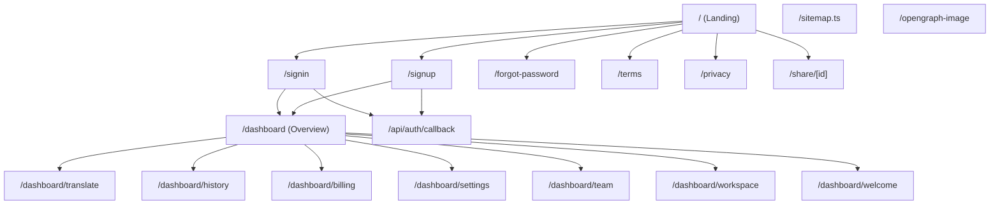
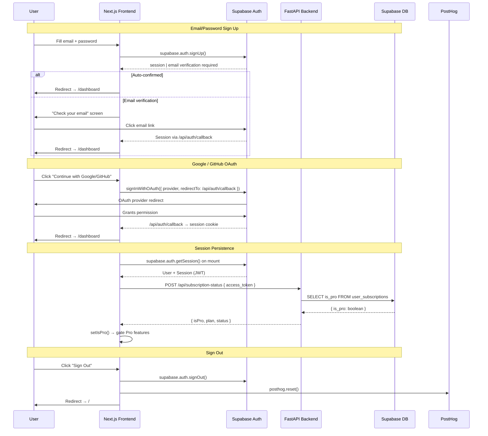
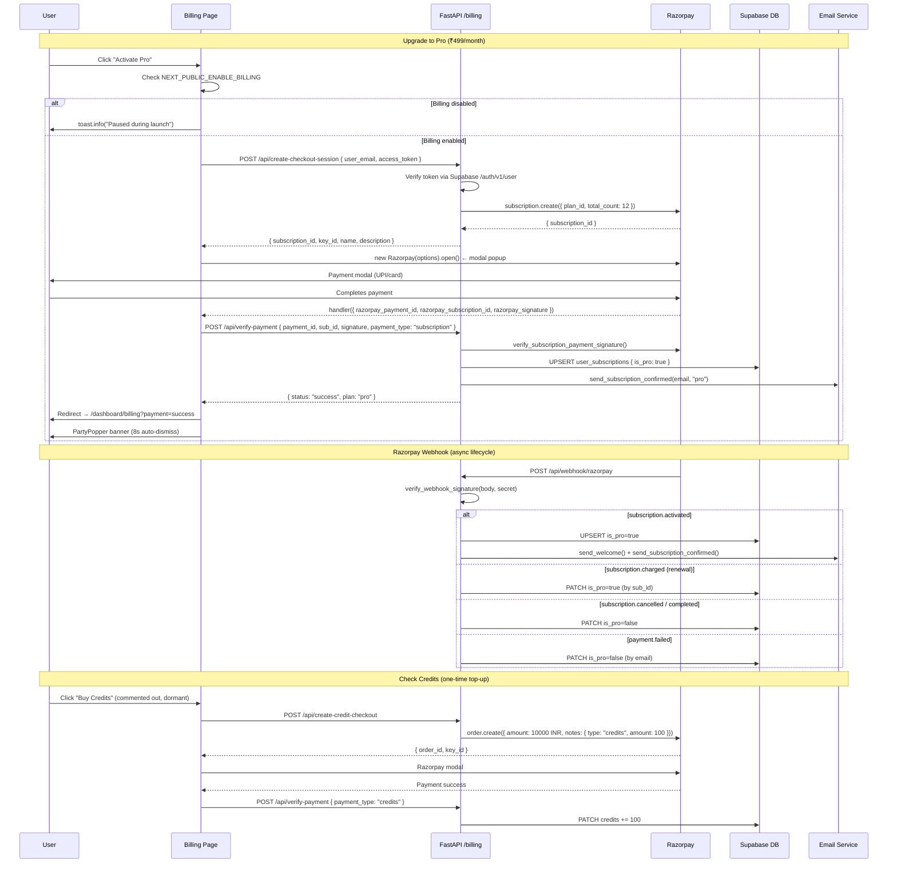
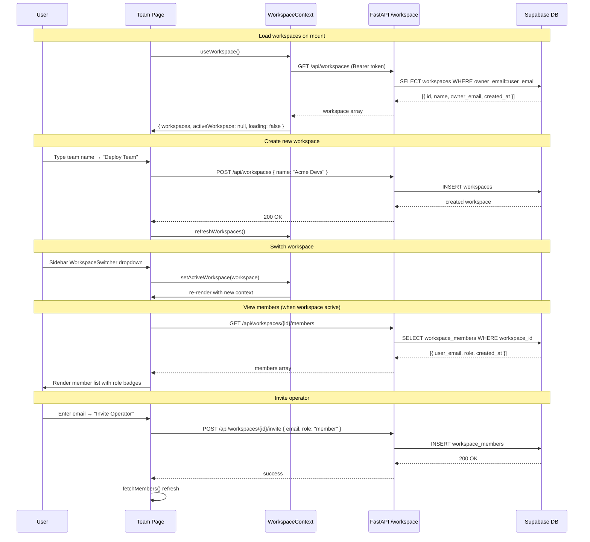

# Anuvaad — Complete Architecture Inventory

> Generated: 2026-06-10 | Source: live codebase scan  
> Stack: Next.js 15 App Router (frontend) · FastAPI (backend) · Supabase Auth · Razorpay Billing · Three.js WebGL · PostHog Analytics

---

## 1. Current Page Map



| Route | File | Type | Auth Required |
|---|---|---|---|
| `/` | `app/page.tsx` | Landing | No |
| `/signup` | `app/signup/page.tsx` | Auth | No |
| `/signin` | `app/signin/page.tsx` | Auth | No |
| `/forgot-password` | `app/forgot-password/page.tsx` | Auth | No |
| `/terms` | `app/terms/page.tsx` | Legal | No |
| `/privacy` | `app/privacy/page.tsx` | Legal | No |
| `/share/[id]` | `app/share/[id]/page.tsx` | Shareable | No |
| `/dashboard` | `app/dashboard/page.tsx` | Dashboard Overview | **Yes** |
| `/dashboard/translate` | `app/dashboard/translate/page.tsx` | Core Feature | **Yes** |
| `/dashboard/history` | `app/dashboard/history/page.tsx` | History Log | **Yes** |
| `/dashboard/billing` | `app/dashboard/billing/page.tsx` | Billing | **Yes** |
| `/dashboard/settings` | `app/dashboard/settings/page.tsx` | User Settings | **Yes** |
| `/dashboard/team` | `app/dashboard/team/page.tsx` | Team Management | **Yes** |
| `/dashboard/workspace` | `app/dashboard/workspace/page.tsx` | Workspace | **Yes** |
| `/dashboard/welcome` | `app/dashboard/welcome/page.tsx` | Onboarding | **Yes** |
| `/api/auth/callback` | `app/api/auth/callback/` | OAuth Callback | No |
| `/sitemap.ts` | `app/sitemap.ts` | SEO | No |
| `/opengraph-image` | `app/opengraph-image.tsx` | Dynamic OG | No |

---

## 2. Current Component Map

### Global / Root Level (`src/`)

| Component | File | Purpose |
|---|---|---|
| `AuthProvider` | `lib/auth-context.tsx` | Session, user state, signIn/signOut methods |
| `WorkspaceProvider` | `context/WorkspaceContext.tsx` | Active workspace + team list |
| `ThemeProvider` | `components/theme-provider.tsx` | Light/dark mode (next-themes) |
| `PostHogProvider` | `components/posthog-provider.tsx` | Analytics opt-in wrapper |
| `TooltipProvider` | `components/ui/tooltip.tsx` | Radix tooltip context |
| `CommandPalette` | `components/CommandPalette.tsx` | Global `⌘K` command palette |
| `Toaster` (sonner) | `app/layout.tsx` | Toast notification system |

### Landing Components (`components/landing/`)

| Component | File | Size | Notes |
|---|---|---|---|
| `Navbar` | `navbar.tsx` | 5.4 KB | Sticky nav with CTA links |
| `Hero` | `hero.tsx` | 13 KB | GSAP entrance + typewriter demo |
| `ScrollStory` | `ScrollStory.tsx` | 24.5 KB | **Largest** — GSAP ScrollTrigger, 6-step pinned narrative |
| `TransformationDemo` | `TransformationDemo.tsx` | 13.8 KB | Interactive 3-tab translate demo |
| `Features` | `features.tsx` | 8.8 KB | Bento grid layout |
| `Positioning` | `Positioning.tsx` | 6.1 KB | Cinematic philosophy section |
| `Trust` | `Trust.tsx` | 6.7 KB | Security & trust signals |
| `Testimonials` | `testimonials.tsx` | 5.2 KB | Infinite marquee |
| `FAQ` | `faq.tsx` | 3 KB | Accordion-based Q&A |
| `FinalCTA` | `FinalCTA.tsx` | 4.3 KB | Bottom conversion section |
| `Footer` | `footer.tsx` | 5.9 KB | Sitemap + links |
| `WebGLCanvas` | `WebGLCanvas.tsx` | 10.4 KB | Three.js particle system |
| `WebGLScrollProvider` | `WebGLScrollProvider.tsx` | 401 B | Lazy-loads WebGLCanvas client-side |
| `SmoothScroll` | `SmoothScroll.tsx` | 4.1 KB | Scroll-position side-nav tracker |
| `Logo` | `Logo.tsx` | 3.8 KB | Shared brand logo component |

### Dashboard Components (inline, within `app/dashboard/`)

> Dashboard uses **no external component files** — all UI is self-contained in each page file.

| Inline Component | Parent File | Purpose |
|---|---|---|
| `DashboardSidebar` | `dashboard/layout.tsx` | Collapsible sidebar, mobile overlay |
| `SidebarContent` | `dashboard/layout.tsx` | Nav links, user card, upgrade CTA |
| `WorkspaceSwitcher` | `dashboard/layout.tsx` | Dropdown workspace selector |
| `UserAvatar` | `dashboard/layout.tsx` | Letter avatar with gradient colors |
| `ActivityBar` | `dashboard/page.tsx` | Mini SVG bar chart (7-day) |
| `QuotaRing` | `dashboard/page.tsx` | SVG radial quota ring |
| `BillingPageContent` | `dashboard/billing/page.tsx` | Wrapped in `<Suspense>` |

### Shared UI Primitives (`components/ui/`) — Radix/shadcn

| Component | File |
|---|---|
| `Accordion` | `accordion.tsx` |
| `Avatar` | `avatar.tsx` |
| `Badge` | `badge.tsx` |
| `Button` | `button.tsx` |
| `Card` | `card.tsx` |
| `Dialog` | `dialog.tsx` |
| `DropdownMenu` | `dropdown-menu.tsx` |
| `Input` | `input.tsx` |
| `Select` | `select.tsx` |
| `Separator` | `separator.tsx` |
| `Sheet` | `sheet.tsx` |
| `Skeleton` | `skeleton.tsx` |
| `Tabs` | `tabs.tsx` |
| `Textarea` | `textarea.tsx` |
| `Tooltip` | `tooltip.tsx` |

### Library / Utility (`src/lib/`)

| Module | File | Purpose |
|---|---|---|
| `supabase` | `supabase.ts` | `createBrowserClient()` singleton |
| `auth-context` | `auth-context.tsx` | Auth context + `useAuth()` hook |
| `analytics` | `analytics.ts` | PostHog wrapper — track, identify, opt-in/out |
| `hooks` | `hooks.ts` | SWR hooks: `useTranslationStats`, `useSubscriptionStatus`, `useCredits` |
| `utils` | `utils.ts` | `cn()` className merger |
| `proxy` | `proxy.ts` | API proxy utility |

---

## 3. Current Landing Page Sections

Sections render **in order** inside `app/page.tsx`:

```
WebGLScrollProvider (fixed, z-index -50)
SmoothScroll (scroll tracker, fixed sidebar dots)
└── <div z-10> ← stacks above WebGL
    Navbar
    main
      ├── #hero     → Hero
      ├── #story    → ScrollStory
      ├── #demo     → TransformationDemo
      ├── #features → Features
      ├──           → Positioning
      ├──           → Trust
      ├──           → Testimonials
      ├── #faq      → FAQ
      └──           → FinalCTA
    Footer
```

| # | Section | Component | Key Content |
|---|---|---|---|
| 1 | **Hero** | `Hero` | GSAP word-by-word entrance, typewriter code→English demo (3 rotating pairs), two CTAs, scroll indicator |
| 2 | **Scroll Story** | `ScrollStory` | 6-chapter pinned narrative ("Riya's journey"), GSAP ScrollTrigger at 600vh, word-reveal narration, IDE visual metaphor canvas |
| 3 | **Transformation Demo** | `TransformationDemo` | 3-tab interactive translator: Code→English, English→Code, Code→Code |
| 4 | **Feature Bento Grid** | `Features` | Grid of key product capabilities |
| 5 | **Positioning** | `Positioning` | Cinematic philosophy / brand differentiation |
| 6 | **Trust & Security** | `Trust` | Security trust signals, compliance badges |
| 7 | **Testimonials** | `Testimonials` | Dual infinite marquee (left/right) |
| 8 | **FAQ** | `FAQ` | Accordion-based questions |
| 9 | **Final CTA** | `FinalCTA` | Bottom conversion block |
| — | **Footer** | `Footer` | Sitemap, legal links, social |
| — | **Navbar** | `Navbar` | Logo, nav links, Sign In / Try Free CTAs |

---

## 4. Current Dashboard Sections

### Layout Shell (`dashboard/layout.tsx`)

```
DashboardLayout
└── WorkspaceProvider (duplicate — also in root layout)
    └── DashboardSidebar
        ├── Desktop Sidebar (fixed, collapsible: 224px ↔ 60px)
        │   ├── Logo
        │   ├── WorkspaceSwitcher (dropdown)
        │   ├── Nav: Dashboard · Workspace · Translate · History · Billing · Settings
        │   ├── ThemeToggle
        │   ├── UserAvatar + email + plan badge
        │   ├── Sign Out button
        │   └── Upgrade CTA card (Free users only)
        └── Mobile Sidebar (full-width drawer, hamburger trigger)
```

**Auth guard:** `useEffect` redirects unauthenticated users → `/signin`  
**Onboarding guard:** Redirects non-onboarded users → `/dashboard/welcome`

---

### Dashboard Overview (`dashboard/page.tsx`)

| Section | Component | Data Source |
|---|---|---|
| Sticky header | Inline | Greeting + date + "New Translation" CTA |
| **Stat Cards** (4) | `Card` grid | `useTranslationStats` SWR hook |
| → Today's Translations | — | `stats.today` (free cap: 10/day) |
| → This Week | — | `stats.week` |
| → All Time | — | `stats.total` |
| → Current Plan | — | `useAuth().isPro` |
| **Quick Actions** | Link cards | Static links to translate modes |
| **7-Day Activity Chart** | `ActivityBar` SVG | `stats.week` distributed across days |
| **Daily Quota Ring** | `QuotaRing` SVG | Free-only, animated SVG circle |
| **Recent Translations** | List | `recentTranslations` (last 5) |
| **Upgrade Banner** | Card | Free users only |

---

### Translate (`dashboard/translate/page.tsx`)
- **65 KB** — largest file in codebase
- Monaco editor integration
- 3 translation modes: Code→English, English→Code, Code→Code
- 35+ language selectors
- Model selection (Groq / DeepSeek)
- Share button → generates `/share/[id]` URL

### History (`dashboard/history/page.tsx`)
- Full translation log with filters
- Pagination / infinite scroll
- Mode badges, language pairs, timestamps

### Billing (`dashboard/billing/page.tsx`)
- Current plan card (Free/Pro)
- Daily quota usage bar (Free only)
- Razorpay upgrade button (Pro features list)
- Payment success/cancel toast banners

### Settings (`dashboard/settings/page.tsx`)
- Profile settings
- API preferences
- Analytics consent toggle

### Team (`dashboard/team/page.tsx`)
- Create workspace form
- Member list (roles: owner / member)
- Invite operator by email form

### Workspace (`dashboard/workspace/page.tsx`)
- Workspace-scoped view
- Shared translation history

### Welcome (`dashboard/welcome/page.tsx`)
- One-time onboarding flow
- Sets `user_metadata.onboarded = true`

---

## 5. Current Design System Inventory

### Typography

| Token | Font | Usage |
|---|---|---|
| `--font-sans` | Inter (Google Fonts) | Primary UI text |
| `--font-mono` | JetBrains Mono (Google Fonts) | Code blocks, editor, terminal |
| `--font-lora` | Lora Italic (Google Fonts) | ScrollStory narration, serif accents |

### Color Palette

#### Brand / Accent
| Token | Value | Usage |
|---|---|---|
| `--color-amber-500` | `#f59e0b` | Primary brand — CTAs, active states |
| `--color-amber-600` | `#d97706` | Hover state for amber |
| `--color-amber-700` | `#b45309` | Pressed state |
| `--amber-glow` | `rgba(245,158,11,0.6)` | Glow effects |
| `--amber-mid` | `rgba(217,119,6,0.4)` | Mid-tone glow |
| `--amber-soft` | `rgba(252,211,77,0.15)` | Soft wash |

#### Landing Surfaces
| Token | Value |
|---|---|
| `--landing-bg` | `#020204` (near-black obsidian) |
| `--landing-charcoal` | `#0c0c0f` |
| `--landing-panel` | `rgba(18,18,24,0.85)` |

#### Dashboard Surfaces
| Token | Value | Description |
|---|---|---|
| `--surface-0` | `#080c14` | Page background |
| `--surface-1` | `#0c0f1a` | Card background |
| `--surface-2` | `#111520` | Elevated panel |
| `--surface-elevated` | `#161b28` | Highest elevation |
| `--surface-card` | `#0e1219` | Standard card |

#### Border System
| Token | Value |
|---|---|
| `--border-subtle` | `rgba(245,158,11,0.08)` |
| `--border-default` | `rgba(245,158,11,0.12)` |
| `--border-active` | `rgba(245,158,11,0.35)` |

#### Text
| Token | Value |
|---|---|
| `--text-primary` | `#e8ecf0` |
| `--text-secondary` | `#8899aa` |
| `--text-muted` | `#5a6a7a` |

### Glow System
| Token | Value |
|---|---|
| `--glow-amber-sm` | `0 0 12px rgba(245,158,11,0.25)` |
| `--glow-amber-md` | `0 0 24px rgba(245,158,11,0.35)` |
| `--glow-amber-lg` | `0 0 48px rgba(245,158,11,0.25), 0 0 100px rgba(245,158,11,0.1)` |

### Radius Scale
| Token | Value |
|---|---|
| `--radius-sm` | `calc(var(--radius) * 0.6)` |
| `--radius-md` | `calc(var(--radius) * 0.8)` |
| `--radius-lg` | `var(--radius)` (0.625rem base) |
| `--radius-xl` | `calc(var(--radius) * 1.4)` |
| `--radius-2xl` | `calc(var(--radius) * 1.8)` |
| `--radius-3xl` | `calc(var(--radius) * 2.2)` |
| `--radius-4xl` | `calc(var(--radius) * 2.6)` |

### Glassmorphism Utilities
| Class | Description |
|---|---|
| `.glass-amber` | Landing panels — `rgba(18,18,24,0.7)`, `blur(20px)`, amber border |
| `.glass-dark` | Auth pages — `rgba(8,12,20,0.8)`, `blur(24px)` |
| `.glass-apple` | macOS-style frosted glass (light: 45% white / dark: 55% dark) |
| `.premium-card` | Gradient dark card with hover border glow |
| `.glow-border` | Amber border with box-shadow glow |

### Scrollbar Styling
- **Width:** 6px  
- **Thumb:** `rgba(245,158,11,0.15)` → hover `rgba(245,158,11,0.3)`  
- **Track:** Transparent

---

## 6. Current Animation Inventory

### CSS Keyframe Animations (defined in `globals.css`)

| Animation | Keyframe Name | Duration / Usage |
|---|---|---|
| Aurora orb drift (A) | `aurora-drift` | 12–14s ease-in-out infinite — landing page background orbs |
| Aurora orb drift (B) | `aurora-drift-2` | 15–18s — secondary orb |
| Particle float | `particle-float` | 3.5–5s infinite — ambient hero dots |
| Shimmer sweep | `shimmer-amber` | 3s linear infinite — `.btn-amber-shimmer`, shimmer loaders |
| Amber pulse ring | `amber-pulse-ring` | 2s — status indicator |
| Marquee left | `marquee-left` | 40s linear infinite — testimonials track |
| Marquee right | `marquee-right` | 45s linear infinite — testimonials track reverse |
| Headline gradient shift | `text-gradient-shift` | 5s ease infinite — `.headline-gradient` text |
| Caret blink | `caret-blink` | 0.8s step-end — typewriter cursors |
| Float slow | `float-slow` | — translateY(-12px) |
| Fade up | `fade-up` | 0.5s ease — `.animate-fade-up` dashboard cards |
| Fade in | `fade-in` | — opacity transition |
| Slide in right | `slide-in-right` | 0.4s |
| Slide in left | `slide-in-left` | 0.4s |
| Glow pulse | `glow-pulse` | 2s ease-in-out infinite — status dot |
| Border glow | `border-glow` | cycling border color |
| Number count | `number-count` | 0.4s cubic-bezier spring |
| Progress fill | `progress-fill` | CSS-var driven bar fill |
| Typing dots | `typing-dots` | 1.4s — AI loading indicator |
| Status ping | `status-ping` | 2s ping expand |
| Shimmer sweep | `shimmer-sweep` | 2s — progress bar overlay |
| Rotate slow | `rotate-slow` | continuous rotation |
| Scan line | `scan-line` | 2s — hero demo reveal |
| Card cascade | `card-cascade` | slide in from right |
| Draw circle | `draw-circle` | SVG stroke animation |
| Mesh drift | `mesh-drift` | 20s — macOS mesh background |
| Blink | `blink` | 1s step-end |

### JavaScript Animations

| Library | Used In | Purpose |
|---|---|---|
| **GSAP** (core) | `Hero`, `ScrollStory` | Entrance timelines, stagger, blur/rotate/opacity |
| **GSAP ScrollTrigger** | `ScrollStory` | Pinned 600vh scroll narrative, scrub 0.5 |
| **Three.js** | `WebGLCanvas` | Full-page particle system (6,000 particles) |
| **Tailwind animate** | Dashboard cards | `.stagger-children` delay utilities |

### Stagger System
`.stagger-children > *:nth-child(n)` — delays from 0ms to 300ms in 60ms steps (up to 6 children)

---

## 7. Current WebGL Inventory

**Component:** [`WebGLCanvas.tsx`](file:///f:/Anuvaad/frontend/src/components/landing/WebGLCanvas.tsx)  
**Provider:** [`WebGLScrollProvider.tsx`](file:///f:/Anuvaad/frontend/src/components/landing/WebGLScrollProvider.tsx) (client-side lazy load)  
**Library:** Three.js (`three`)  
**Z-index:** `-50` (fixed, behind all content)  
**Blend Mode:** `screen`

### Particle System Configuration
| Parameter | Value |
|---|---|
| Particle count | **6,000** |
| Pixel ratio cap | `Math.min(devicePixelRatio, 2)` |
| Anti-alias | `true` |
| Clear color | `#030014` |
| Fog | `FogExp2(0x030014, density: 0.015)` |
| Material | `PointsMaterial`, `AdditiveBlending`, `depthWrite: false` |
| Particle size | `0.28` |
| Opacity | `0.85` |
| Circle texture | Canvas-generated radial gradient (32×32) |

### Particle Color Palette
| Color | Hex | Description |
|---|---|---|
| Indigo | `#6366f1` | Primary cosmic |
| Pink/Violet | `#ec4899` | Accent |
| Cyan | `#06b6d4` | Cool highlight |
| Amber/Gold | `#f59e0b` | Brand match |

### Layout Morphing System (scroll-driven)

| Scroll Range | From Shape | To Shape | Description |
|---|---|---|---|
| 0% → 30% | Tunnel/Vortex | Grid Constellation | Spiral cylinder → 80-column flat grid |
| 30% → 65% | Grid | Wave Stream | Grid → flowing sinusoidal wave |
| 65% → 100% | Wave | Plasma Sphere | Wave → central sphere (r=8 units) |

**Lerp factor:** `0.1` per frame (smooth, not instant)

### Mouse Interaction
- Mouse position → camera `position.x/y` (`×3` multiplier)
- Particle repulsion within radius `4`: `force = (4 - dist) × 0.08`
- Smooth lerp: mouse `0.05`, scroll `0.08`

### Render Loop
```
requestAnimationFrame tick()
  → lerp mouse/scroll values
  → update camera position
  → rotate particle system (y: time×0.03, x: sin×0.05)
  → morph particle positions based on scroll %
  → needsUpdate = true
  → renderer.render(scene, camera)
```

### Cleanup
Full cleanup on unmount: removes event listeners, cancels animation frame, disposes geometry/material/renderer.

---

## 8. Current Authentication Flow



### Auth State Shape (`AuthContext`)
```typescript
{
  user: User | null          // Supabase User object
  session: Session | null    // JWT session with access_token
  loading: boolean           // Initial session check in progress
  isPro: boolean             // Derived from /api/subscription-status
  signInWithEmail()          // supabase.auth.signInWithPassword
  signUpWithEmail()          // supabase.auth.signUp
  signInWithGoogle()         // OAuth redirect → /api/auth/callback
  signInWithGitHub()         // OAuth redirect → /api/auth/callback
  signOut()                  // clears session + PostHog identity
}
```

### Guards
- **Dashboard layout:** `useEffect` → if `!loading && !user` → `router.push('/signin')`
- **Onboarding guard:** `!user.user_metadata?.onboarded && pathname !== '/dashboard/welcome'` → redirect to `/dashboard/welcome`

### Signup Security
- **Honeypot field:** Hidden `name="website"` input to block bots
- **Redirect sanitization:** `redirectTo` param validated to start with `/` and not `//`

---

## 9. Current Billing Flow



### Billing Feature Flags
| Flag | Env Var | Effect when `false` |
|---|---|---|
| Billing enabled | `NEXT_PUBLIC_ENABLE_BILLING` | Upgrade button disabled, launch toast shown |
| Backend billing | `ENABLE_BILLING` | All billing endpoints return HTTP 503 |

### Pricing
| Plan | Price | Quota | Features |
|---|---|---|---|
| Free (Sandbox) | ₹0/month | 10 translations/day | 35+ languages, 3 modes |
| Pro | ₹499/month | Unlimited | Priority AI, 50K char buffer, team workspaces, early features |
| Credits | ₹100 (dormant) | +100 translations | One-time top-up (UI commented out) |

---

## 10. Current Workspace / Team Flow



### Workspace Data Model
```typescript
interface Workspace {
  id: string
  name: string
  owner_email: string
  created_at: string
}

interface WorkspaceMember {
  user_email: string
  role: "owner" | "member"
  created_at: string
}
```

### WorkspaceContext API
```typescript
{
  workspaces: Workspace[]              // All workspaces user belongs to
  activeWorkspace: Workspace | null    // Currently selected (null = Personal)
  setActiveWorkspace(ws | null): void  // Switch context
  refreshWorkspaces(): Promise<void>   // Re-fetch from API
  loading: boolean
}
```

### Backend Workspace Router (`app/routers/workspace.py`)

| Endpoint | Method | Description |
|---|---|---|
| `/api/workspaces` | `GET` | List user's workspaces |
| `/api/workspaces` | `POST` | Create new workspace |
| `/api/workspaces/{id}/members` | `GET` | List workspace members |
| `/api/workspaces/{id}/invite` | `POST` | Invite a user by email |

### Workspace Switcher UI (sidebar)
- Shown only in expanded sidebar (`!collapsed`)
- "Personal Workspace" is the null/default state
- Each workspace shown with initial letter avatar (amber `bg-amber-500/15`)
- Active workspace: highlighted amber row

---

## Backend API Surface Summary

### FastAPI Routers (`app/routers/`)

| Router File | Prefix | Endpoints |
|---|---|---|
| `translate.py` | `/api` | `/translate`, `/detect-language`, `/share`, `/get-share` |
| `history.py` | `/api` | `/history`, `/stats`, `/history/{id}` |
| `workspace.py` | `/api` | `/workspaces`, `/workspaces/{id}/members`, `/workspaces/{id}/invite` |
| `billing.py` | `/api` | `/create-checkout-session`, `/create-portal-session`, `/create-credit-checkout`, `/check-credits`, `/verify-payment`, `/webhook/razorpay`, `/subscription-status` |
| `utility.py` | `/api` | `/health`, `/metrics`, and support utilities |

### Backend Services (`app/services/`)

| Service | File | Purpose |
|---|---|---|
| AI Service | `ai.py` (20 KB) | Groq + DeepSeek API calls, model routing, prompt construction |
| Email Service | `email.py` (8.9 KB) | Transactional emails (welcome, subscription confirmed) |

### Backend Core (`app/core/`)

| Module | File | Purpose |
|---|---|---|
| Auth | `auth.py` | `get_user_email()` dependency — JWT token verification via Supabase |
| Cache | `cache.py` | Redis client, rate-limit counters |
| Config | `config.py` | Env vars, logger, Sentry, lifespan |
| Database | `database.py` | `supabase_request()` — generic Supabase REST client |
| Quota | `quota.py` | Daily translation quota enforcement (free: 10/day) |

### Middleware Stack (in order)
1. **CORS** — allowlist: production domain + localhost variants
2. **Security Headers** — X-Frame-Options, CSP, X-XSS-Protection, etc.
3. **CSRF Origin** — production-only: validates Origin/Referer for POST/PATCH/DELETE
4. **Metrics** — per-endpoint latency + error tracking
5. **Rate Limit** — 50 req/min (IP) or 200 req/min (authenticated user token)
