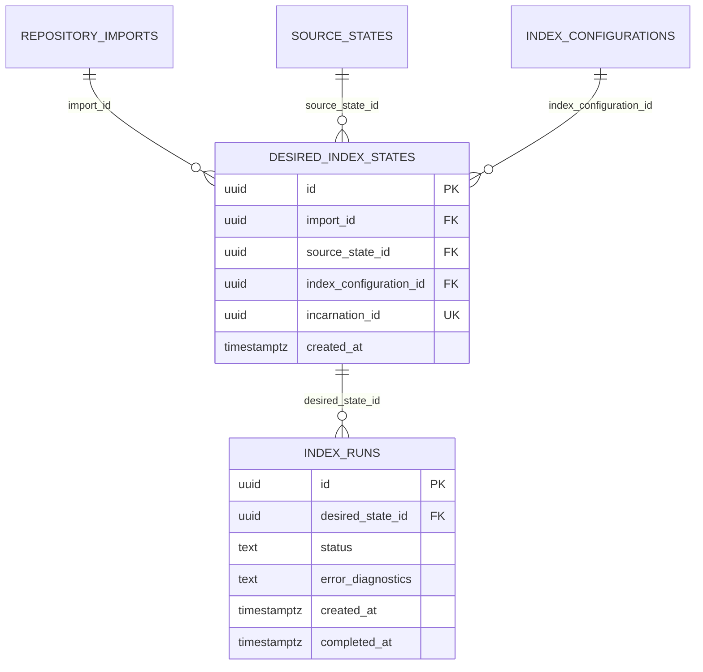

# Phase 1B Schema ERD

Phase 1B introduces only the index lifecycle schema. It does not add
searchable materializations, structural persistence, retrieval, APIs, or
background-worker behavior.

The `incarnation_id` uniqueness constraint preserves a non-repeating desired
state identity. `IndexRun` records lifecycle execution state only; publication
and searchable persistence remain Phase 1C work.
