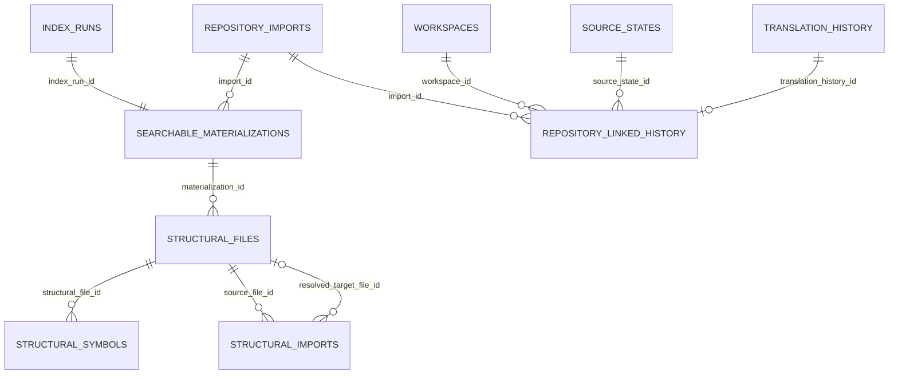

# Phase 1C Schema ERD

Phase 1C adds only published-searchable persistence, lightweight structural
metadata, and repository-linked translation provenance. It does not add
extraction, embedding, retrieval, APIs, or background-worker behavior.

`uq_searchable_materializations_current_import` is a partial unique index that
permits historic materializations while allowing at most one current searchable
materialization per repository import. Declared imports are deliberately kept
separate from their optional resolved file target; no symbol-reference or
call-graph persistence is introduced.
