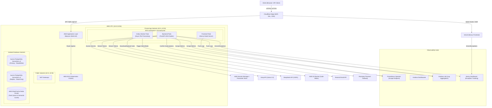

# Anuvaad — Enterprise Production DevOps & Infrastructure Blueprint

This blueprint outlines the production-ready infrastructure design, deployment workflows, CI/CD pipelines, Kubernetes configurations, monitoring strategies, and release checklists for **Anuvaad**. It is designed to scale to thousands of concurrent users, handle long-lived Server-Sent Events (SSE) translation streams, protect sensitive data, and minimize system downtime.

---

## 1. Production Infrastructure Architecture

The production architecture transitions Anuvaad from a single-node Docker Compose setup to a highly-available, multi-AZ cloud topology on AWS, fronted by Cloudflare at the Edge.

### 1.1 High-Level Infrastructure Topology



### 1.2 Network Partitioning & Security

To enforce the principle of least privilege at the network level, the AWS VPC is split into three distinct subnet tiers across 2 Availability Zones (us-east-1a and us-east-1b):

1. **Public Subnets (`10.0.1.0/24`, `10.0.2.0/24`)**:
   - Houses the AWS Application Load Balancer (ALB) and public NAT Gateways.
   - Direct inbound internet access is allowed **only** to the ALB on ports 80 and 443.
2. **Private Application Subnets (`10.0.10.0/24`, `10.0.11.0/24`)**:
   - Houses the EKS Kubernetes worker nodes.
   - All outgoing traffic is routed through the NAT Gateways in the public subnets.
   - No direct inbound route from the internet. Ingress is restricted to traffic originating from the ALB security group.
3. **Isolated Data Subnets (`10.0.20.0/24`, `10.0.21.0/24`)**:
   - Houses the AWS Aurora PostgreSQL cluster and ElastiCache Redis cluster.
   - Absolutely no internet access (no route to NAT Gateways).
   - Inbound access is strictly limited via Security Group rules to the EKS worker nodes on port 5432 (Postgres) and 6379 (Redis).

### 1.3 Handling Persistent SSE Streams & Concurrency

Server-Sent Events (SSE) used in Anuvaad's real-time translations pose specific architectural challenges due to their long-lived nature:

- **Multiplexing at the Edge**: Cloudflare is configured to use **HTTP/2** and **HTTP/3** to bypass the browser limit of 6 concurrent HTTP/1.1 connections per host, allowing users to run multiple translation screens simultaneously.
- **Connection Keep-Alives**: The ALB idle timeout is set to `3600 seconds` (1 hour) to prevent the load balancer from terminating connections when DeepSeek R1 takes longer to stream reasoning tokens.
- **Reverse Proxy Buffering**: Nginx (if used as an ingress controller or sidecar) is configured with `proxy_buffering off;` and `proxy_cache off;` for the `/api/v1/translate/stream` path to prevent buffering delays on chunked text delivery.

---

## 2. Deployment Workflow & GitOps

We utilize a GitOps-based deployment strategy to ensure the production environment remains declarative, reproducible, and auditable.

```
                  ┌──────────────┐
                  │ Feature Branch│
                  └──────┬───────┘
                         │ PR to 'main'
                         ▼
                  ┌──────────────┐
                  │  Staging Environment
                  │    (Auto-deploy)
                  └──────┬───────┘
                         │ Create Release Tag
                         ▼
                  ┌──────────────┐
                  │ Production GitOps
                  │  (ArgoCD Sync)
                  └──────────────┘
```

### 2.1 Git Branching & Promotion Path

1. **Trunk-Based Development with Release Tags**:
   - Developers work in short-lived feature branches and merge into the `main` branch via Pull Requests (PRs).
   - Every merge to `main` triggers automated CI builds and deploys directly to the **Staging Environment** for integration testing.
   - Production deployments are triggered exclusively by creating a git semver release tag (e.g., `v1.2.0`).
2. **GitOps Manifest Repository**:
   - Application configuration and Kubernetes manifests are maintained in a dedicated environment repo (or a `/k8s` directory in the main repo).
   - An orchestration agent (e.g., **ArgoCD** or **Flux**) runs inside the EKS cluster, continuously monitoring the repo and syncing the cluster state to match the target git revision.

### 2.2 Zero-Downtime Deployment Strategy

To prevent downtime during deployments, we use a **Rolling Update** strategy:

- **Readiness Probes**: Kubernetes will not route traffic to a newly deployed Pod until its `/api/health` endpoint returns a success status.
- **Rolling Configuration**:
  ```yaml
  strategy:
    type: RollingUpdate
    rollingUpdate:
      maxSurge: 25%        # Spawns at most 25% additional temporary pods
      maxUnavailable: 0%   # Ensures no active pods are terminated until new ones are ready
  ```
- **Graceful Shutdown**: Next.js and FastAPI pods handle the `SIGTERM` signal. The FastAPI application stops accepting new connections, processes outstanding requests in its queue, and exits within a 30-second grace window (`terminationGracePeriodSeconds: 30`).

---

## 3. CI/CD Pipeline Configuration

This GitHub Actions workflow handles continuous integration (linting, static analysis, unit tests) and continuous deployment (Docker building, vulnerability scanning, and pushing to ECR/updating K8s).

### 3.1 GitHub Actions Workflow

Create this file at `.github/workflows/production-pipeline.yml` in the repository:

```yaml
name: CI/CD Production Pipeline

on:
  push:
    branches:
      - main
    tags:
      - 'v*.*.*'
  pull_request:
    branches:
      - main

permissions:
  contents: read
  id-token: write # Required for AWS OIDC authentication

jobs:
  # ── STAGE 1: TEST & AUDIT ──
  test:
    name: Lint, Audit, and Unit Test
    runs-on: ubuntu-latest
    steps:
      - name: Checkout Code
        uses: actions/checkout@v4

      - name: Set up Python
        uses: actions/setup-python@v5
        with:
          python-node-version: '3.11'
          cache: 'pip'

      - name: Install Python Dependencies
        run: |
          python -m pip install --upgrade pip
          pip install -r requirements.txt pytest ruff pip-audit

      - name: Lint Python Code
        run: ruff check app/ main.py

      - name: Security Audit Python Dependencies
        run: pip-audit --local

      - name: Run Python Unit Tests
        run: pytest tests/
        env:
          ENV: testing
          REDIS_URL: redis://localhost:6379/0
          SUPABASE_URL: https://mock.supabase.co
          SUPABASE_ANON_KEY: mock-key

      - name: Set up Node.js
        uses: actions/setup-node@v4
        with:
          node-version: '20'
          cache: 'npm'
          cache-dependency-path: frontend/package-lock.json

      - name: Install Frontend Dependencies
        working-directory: ./frontend
        run: npm ci

      - name: Lint Frontend Code
        working-directory: ./frontend
        run: npm run lint

  # ── STAGE 2: BUILD & PUSH DOCKER IMAGES ──
  build-and-push:
    name: Build & Push Production Docker Images
    needs: test
    if: startsWith(github.ref, 'refs/tags/v') # Run only on release tags
    runs-on: ubuntu-latest
    steps:
      - name: Checkout Code
        uses: actions/checkout@v4

      - name: Configure AWS Credentials (OIDC)
        uses: aws-actions/configure-aws-credentials@v4
        with:
          role-to-assume: arn:aws:iam::123456789012:role/github-actions-ecr-role
          aws-region: us-east-1

      - name: Log in to AWS ECR
        id: login-ecr
        uses: aws-actions/amazon-ecr-login@v2

      - name: Set up Docker Buildx
        uses: docker/setup-buildx-action@v3

      # Build Backend Image
      - name: Build and Push Backend
        uses: docker/build-push-action@v5
        with:
          context: .
          file: ./Dockerfile
          push: true
          tags: |
            ${{ steps.login-ecr.outputs.registry }}/anuvaad-backend:${{ github.ref_name }}
            ${{ steps.login-ecr.outputs.registry }}/anuvaad-backend:latest
          cache-from: type=gha,scope=backend
          cache-to: type=gha,mode=max,scope=backend

      # Build Frontend Image
      - name: Build and Push Frontend
        uses: docker/build-push-action@v5
        with:
          context: ./frontend
          file: ./frontend/Dockerfile
          push: true
          tags: |
            ${{ steps.login-ecr.outputs.registry }}/anuvaad-frontend:${{ github.ref_name }}
            ${{ steps.login-ecr.outputs.registry }}/anuvaad-frontend:latest
          build-args: |
            NEXT_PUBLIC_API_URL=https://api.anuvaad.dev
            NEXT_PUBLIC_SUPABASE_URL=https://prod-supabase.supabase.co
          cache-from: type=gha,scope=frontend
          cache-to: type=gha,mode=max,scope=frontend

      # Vulnerability Scan on Backend
      - name: Run Trivy Security Scan
        uses: aquasecurity/trivy-action@master
        with:
          image-ref: '${{ steps.login-ecr.outputs.registry }}/anuvaad-backend:${{ github.ref_name }}'
          format: 'table'
          exit-code: '1'
          ignore-unfixed: true
          vuln-type: 'os,library'
          severity: 'CRITICAL,HIGH'

  # ── STAGE 3: GITOPS DEPLOY ──
  deploy:
    name: GitOps Deployment Trigger
    needs: build-and-push
    runs-on: ubuntu-latest
    steps:
      - name: Checkout Manifests Repo
        uses: actions/checkout@v4
        with:
          repository: 'tarunvamsivaka/anuvaad-gitops'
          token: ${{ secrets.GITOPS_REPO_PAT }}
          ref: 'main'

      - name: Update Kubernetes Image Tag
        run: |
          sed -i 's|image: .*/anuvaad-backend:.*|image: 123456789012.dkr.ecr.us-east-1.amazonaws.com/anuvaad-backend:${{ github.ref_name }}|g' k8s/backend-deployment.yaml
          sed -i 's|image: .*/anuvaad-frontend:.*|image: 123456789012.dkr.ecr.us-east-1.amazonaws.com/anuvaad-frontend:${{ github.ref_name }}|g' k8s/frontend-deployment.yaml

      - name: Commit and Push Manifest Changes
        run: |
          git config --global user.name "GitHub Actions"
          git config --global user.email "actions@github.com"
          git add k8s/
          git commit -m "Deploy tag ${{ github.ref_name }} [skip ci]"
          git push origin main
```

---

## 4. Docker & Kubernetes Setup

We separate our environments cleanly and configure Kubernetes resources with isolation, resource constraints, and health checking.

### 4.1 Hardened Multi-Stage Backend Dockerfile

This overrides the local development setup with a non-root context and optimized runtime layer. Reference the existing [Dockerfile](file:///f:/Anuvaad/Dockerfile) for comparison.

```dockerfile
# ── Stage 1: Dependency Builder ──
FROM python:3.11-slim-bookworm AS builder
WORKDIR /app
RUN apt-get update && apt-get install -y --no-install-recommends \
    build-essential \
    libpq-dev \
    curl \
    && rm -rf /var/lib/apt/lists/*

COPY requirements.txt .
RUN pip install --no-cache-dir --user -r requirements.txt gunicorn uvicorn

# ── Stage 2: Runtime Image ──
FROM python:3.11-slim-bookworm AS runtime
WORKDIR /app

RUN apt-get update && apt-get install -y --no-install-recommends \
    libpq5 \
    curl \
    && rm -rf /var/lib/apt/lists/*

# Copy python dependencies from builder
COPY --from=builder /root/.local /root/.local
ENV PATH=/root/.local/bin:$PATH
ENV PYTHONUNBUFFERED=1
ENV PYTHONDONTWRITEBYTECODE=1
ENV ENV=production

# Create non-root system user
RUN groupadd -g 10001 appgroup && \
    useradd -u 10000 -g appgroup -m -s /bin/bash appuser

# Copy application files
COPY --chown=appuser:appgroup ./app ./app
COPY --chown=appuser:appgroup ./main.py ./main.py

USER appuser
EXPOSE 8000

HEALTHCHECK --interval=30s --timeout=5s --start-period=10s --retries=3 \
  CMD curl -f http://localhost:8000/api/health || exit 1

CMD ["gunicorn", "main:app", "--workers", "4", "--worker-class", "uvicorn.workers.UvicornWorker", "--bind", "0.0.0.0:8000"]
```

### 4.2 Production Kubernetes Manifests

Below are the complete resource declarations for deployment inside EKS.

#### namespace.yaml
```yaml
apiVersion: v1
kind: Namespace
metadata:
  name: anuvaad-prod
  labels:
    name: anuvaad-prod
```

#### configmap.yaml
```yaml
apiVersion: v1
kind: ConfigMap
metadata:
  name: anuvaad-config
  namespace: anuvaad-prod
data:
  ENV: "production"
  FRONTEND_URL: "https://anuvaad.dev"
  REDIS_URL: "redis://redis-master.anuvaad-prod.svc.cluster.local:6379/0"
```

#### secrets.yaml (Template)
```yaml
apiVersion: v1
kind: Secret
metadata:
  name: anuvaad-secrets
  namespace: anuvaad-prod
type: Opaque
stringData:
  # Infused at runtime via Secrets Manager integration or CI/CD
  GROQ_API_KEY: "your_production_groq_key"
  DEEPSEEK_API_KEY: "your_production_deepseek_key"
  SUPABASE_URL: "https://your-supabase.supabase.co"
  SUPABASE_SERVICE_ROLE_KEY: "your_service_role_key"
  REDIS_PASSWORD: "strong_redis_password"
```

#### backend-deployment.yaml
```yaml
apiVersion: apps/v1
kind: Deployment
metadata:
  name: anuvaad-backend
  namespace: anuvaad-prod
  labels:
    app: anuvaad-backend
spec:
  replicas: 3
  selector:
    matchLabels:
      app: anuvaad-backend
  strategy:
    type: RollingUpdate
    rollingUpdate:
      maxSurge: 25%
      maxUnavailable: 0
  template:
    metadata:
      labels:
        app: anuvaad-backend
    spec:
      securityContext:
        runAsNonRoot: true
        runAsUser: 10000
        fsGroup: 10001
      containers:
        - name: backend
          image: 123456789012.dkr.ecr.us-east-1.amazonaws.com/anuvaad-backend:latest
          imagePullPolicy: IfNotPresent
          ports:
            - containerPort: 8000
              name: http
          envFrom:
            - configMapRef:
                name: anuvaad-config
            - secretRef:
                name: anuvaad-secrets
          resources:
            requests:
              cpu: "500m"
              memory: "1Gi"
            limits:
              cpu: "1500m"
              memory: "2Gi"
          securityContext:
            allowPrivilegeEscalation: false
            readOnlyRootFilesystem: true
            capabilities:
              drop:
                - ALL
          livenessProbe:
            httpGet:
              path: /api/health
              port: http
            initialDelaySeconds: 15
            periodSeconds: 20
            timeoutSeconds: 5
          readinessProbe:
            httpGet:
              path: /api/health
              port: http
            initialDelaySeconds: 10
            periodSeconds: 10
            timeoutSeconds: 2
          lifecycle:
            preStop:
              exec:
                command: ["/bin/sh", "-c", "sleep 15"] # Gives ingress controller time to remove pod from routing table
```

#### service.yaml (Backend Internal Router)
```yaml
apiVersion: v1
kind: Service
metadata:
  name: anuvaad-backend-service
  namespace: anuvaad-prod
spec:
  type: ClusterIP
  ports:
    - port: 8000
      targetPort: 8000
      protocol: TCP
      name: http
  selector:
    app: anuvaad-backend
```

#### hpa.yaml (Horizontal Pod Autoscaler)
```yaml
apiVersion: autoscaling/v2
kind: HorizontalPodAutoscaler
metadata:
  name: anuvaad-backend-hpa
  namespace: anuvaad-prod
spec:
  scaleTargetRef:
    apiVersion: apps/v1
    kind: Deployment
    name: anuvaad-backend
  minReplicas: 3
  maxReplicas: 10
  metrics:
    - type: Resource
      resource:
        name: cpu
        target:
          type: Utilization
          averageUtilization: 70
    - type: Resource
      resource:
        name: memory
        target:
          type: Utilization
          averageUtilization: 80
```

#### ingress.yaml
```yaml
apiVersion: networking.k8s.io/v1
kind: Ingress
metadata:
  name: anuvaad-ingress
  namespace: anuvaad-prod
  annotations:
    kubernetes.io/ingress.class: alb
    alb.ingress.kubernetes.io/scheme: internet-facing
    alb.ingress.kubernetes.io/target-type: ip
    alb.ingress.kubernetes.io/listen-ports: '[{"HTTP": 80}, {"HTTPS":443}]'
    alb.ingress.kubernetes.io/ssl-redirect: '443'
    alb.ingress.kubernetes.io/certificate-arn: arn:aws:acm:us-east-1:123456789012:certificate/abc-123-xyz
    alb.ingress.kubernetes.io/ssl-policy: ELBSecurityPolicy-TLS13-1-2-2021-06
    alb.ingress.kubernetes.io/backend-protocol: HTTP
spec:
  rules:
    - host: api.anuvaad.dev
      http:
        paths:
          - path: /
            pathType: Prefix
            backend:
              service:
                name: anuvaad-backend-service
                port:
                  number: 8000
```

---

## 5. Monitoring & Logging Strategy

High-scale Server-Sent Events systems require granular monitoring metrics to catch stalled requests, memory leaks, and rate-limiting issues.

### 5.1 Prometheus Metric Instrumentation

FastAPI exposes an instrumentation endpoint `/api/metrics/prometheus`. We monitor the following custom domains:

- `http_requests_total{method, status, handler}`: Track HTTP traffic and API usage.
- `sse_active_connections`: Gauges currently open translation connections.
- `llm_translation_latency_seconds`: Track time spent on Groq vs DeepSeek calls.
- `llm_failover_occurrences_total`: Counts when Groq fails and DeepSeek (or vice-versa) is selected.
- `redis_rate_limit_hits_total`: Monitors limits enforced.

### 5.2 Prometheus Alerting Rules (`prometheus-alerts.yaml`)

```yaml
groups:
  - name: anuvaad-alerts
    rules:
      # Alert on High Error Rates (5xx status)
      - alert: HighAPIErrorRate
        expr: sum(rate(http_requests_total{status=~"5.."}[5m])) / sum(rate(http_requests_total[5m])) * 100 > 5
        for: 2m
        labels:
          severity: critical
        annotations:
          summary: "High API Error Rate detected"
          description: "API status errors are currently at {{ $value }}% (threshold > 5%) for the last 2 minutes."

      # Alert on Slow LLM Streams
      - alert: SlowLLMStreams
        expr: histogram_quantile(0.95, sum(rate(llm_translation_latency_seconds_bucket[5m])) by (le)) > 10
        for: 5m
        labels:
          severity: warning
        annotations:
          summary: "95th percentile LLM Latency is > 10s"
          description: "95% of translation requests are taking longer than 10 seconds to generate completions."

      # Alert on Redis Queue Congestion
      - alert: RedisQueueCongestion
        expr: celery_queue_length > 100
        for: 5m
        labels:
          severity: warning
        annotations:
          summary: "Celery task queue is piling up"
          description: "There are currently {{ $value }} queued async tasks waiting in Redis (threshold > 100)."

      # Alert on Database Connection Exhaustion
      - alert: DatabaseConnectionsExhausted
        expr: pg_stat_activity_count{state="active"} / pg_settings_max_connections * 100 > 85
        for: 5m
        labels:
          severity: critical
        annotations:
          summary: "PostgreSQL Database connections exceeding 85%"
          description: "Active database connections are currently utilizing {{ $value }}% of pg_max_connections limits."
```

### 5.3 Grafana Dashboard Blueprint

The production dashboard contains 4 dedicated sections:

1. **System Health**:
   - CPU/Memory usage per pod + aggregate node usage.
   - Network bandwidth metrics.
   - Pod restart rates.
2. **API Metrics**:
   - Request throughput (RPS).
   - Response latency heatmaps (P50, P90, P99).
   - SSE connection gauge (active vs completed sessions).
3. **External Dependencies**:
   - Response time of Groq API & DeepSeek API.
   - Database transactions/sec & connection pool levels.
   - Redis query performance (GET/SET cache hits vs misses).
4. **Business Analytics**:
   - Subscribed Users (Pro vs Free ratio).
   - Total tokens processed per hour.
   - Razorpay transaction success rates.

### 5.4 Logging Architecture (Grafana Loki & FluentBit)

- **Standard Logging Format**: All backend logs are written to stdout in a single line JSON format, configured via standard Python filters:
  ```json
  {"timestamp": "2026-06-14T17:58:00.123Z", "level": "INFO", "logger": "app.services.translate", "message": "Translation cache miss. Querying Groq API.", "user_email": "user@test.com", "execution_time_ms": 142}
  ```
- **Scraping**: FluentBit runs as a DaemonSet on the EKS nodes, parsing JSON fields out of container runtime logs.
- **Log Retention**: Log data is shipped to Grafana Loki (or AWS CloudWatch Logs) with a strict **30-day retention** policy to manage storage costs.

---

## 6. Production Deployment Checklist

Use this checklist to execute a clean deployment and verify that the system is fully operational.

### 6.1 Pre-Flight Check (Before Release)

- [ ] **Secret Audit**: Confirm no development secret values exist in Kubernetes ConfigMaps or the CI/CD files. Use AWS Secrets Manager for production tokens.
- [ ] **API Quota Check**: Verify Groq and DeepSeek keys have active credit lines and high rate limit allowances (TPM/RPM) configured on the respective platforms.
- [ ] **DNS Mapping**: Verify DNS domains (`anuvaad.dev` and `api.anuvaad.dev`) are registered, routed through Cloudflare, and DNS proxy status is enabled.
- [ ] **Database Connection Pool**: Tune the PostgreSQL database server parameters to match maximum client counts:
  ```sql
  ALTER SYSTEM SET max_connections = 250;
  -- If using Supabase Poolers, check PgBouncer pool modes are set to 'transaction' rather than 'session'.
  ```

### 6.2 Execution Phase (Deploy Day)

- [ ] **Apply Migrations**: Execute the latest database migrations in the isolation layer before launching newer code:
  ```bash
  npx supabase db push --db-url "postgresql://postgres.prod-db:5432/postgres"
  ```
- [ ] **Deploy Core Services**: Apply the Kubernetes manifests or run the GitOps promotion sync:
  ```bash
  kubectl apply -f k8s/namespace.yaml
  kubectl apply -f k8s/configmap.yaml
  kubectl apply -f k8s/secrets.yaml
  kubectl apply -f k8s/backend-deployment.yaml
  kubectl apply -f k8s/service.yaml
  kubectl apply -f k8s/ingress.yaml
  kubectl apply -f k8s/hpa.yaml
  ```
- [ ] **Rollout Status Check**: Verify the status of the rollout:
  ```bash
  kubectl rollout status deployment/anuvaad-backend -n anuvaad-prod
  ```

### 6.3 Post-Flight Verification (Sanity Smoke Test)

- [ ] **Direct SSL verification**: Confirm HTTPS connections terminate correctly with TLS 1.2 or TLS 1.3:
  ```bash
  curl -Iv https://api.anuvaad.dev/api/health
  ```
- [ ] **Rate Limiter Validation**: Make 20 rapid requests to `/api/health` and verify the server begins returning HTTP `429 Too Many Requests` when limits are breached.
- [ ] **SSE Streaming Check**: Test streaming capability using curl:
  ```bash
  curl -N -X POST https://api.anuvaad.dev/api/v1/translate/stream \
    -H "Content-Type: application/json" \
    -H "Authorization: Bearer <PROD_TEST_JWT_TOKEN>" \
    -d '{"raw_code":"print(\"hello\")","language":"python","mode":"code-to-english"}'
  ```
  *Verify that chunks stream immediately and do not arrive in a single block.*
- [ ] **Sentry Connection Test**: Trigger a test exception on the backend and ensure the notification appears in the Sentry dashboard.

### 6.4 Disaster Recovery & Rollback Protocols

#### Rollback Execution Plan (If deployment fails sanity tests)
1. **Revert GitOps tag**: Update the GitOps Manifest repository revision pointer back to the previous stable release commit (e.g., `v1.1.9`).
2. **Force Kubernetes Rollback**:
   ```bash
   kubectl rollout undo deployment/anuvaad-backend -n anuvaad-prod
   ```
3. **Database Migration Recovery**: If the schema migration broke backward compatibility, restore the database structure:
   - Run the down migration scripts (if rollback SQL scripts exist in the migrations directory).
   - If data corruption occurred, restore PostgreSQL from the AWS Aurora nightly snapshot or Point-In-Time-Recovery (PITR) to a timestamp immediately prior to migration.

#### PostgreSQL Auto-Backup Policy
- AWS Aurora backups are configured for **automated hourly snapshots** with a **14-day retention window**.
- Read replicas are automatically promoted to primary nodes in the event of an Availability Zone outage (failover completes in under 30 seconds).
