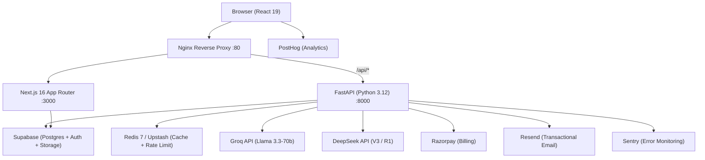

# Anuvaad — Complete Technical Audit

> Audit Date: 2026-06-10 | Audited by: Antigravity | No code changes made.

---

## 1. Current Architecture

Anuvaad is a **full-stack SaaS product** built on a classic three-tier architecture with a serverless-friendly backend.



### Key Architectural Decisions

| Decision | Implementation |
|---|---|
| **API gateway** | Nginx proxies `/api/*` to FastAPI, everything else to Next.js |
| **Auth** | Supabase Auth (JWT) + API key (`ak_` prefix) via hashed lookup |
| **Streaming** | SSE (`text/event-stream`) for real-time LLM output; rAF-batched on client |
| **Caching** | 3-tier: Redis → Upstash REST → in-memory LRU (auto-fallback) |
| **LLM routing** | Primary/fallback: free=Groq (Llama 3.3), pro=DeepSeek (V3/R1) |
| **Quota** | Per-user daily limits enforced via `enforce_quotas_and_protection` |
| **Billing** | Razorpay subscriptions + credit top-ups; payment verification server-side |
| **Email** | Resend for transactional (welcome, milestones) |
| **Monitoring** | Sentry (backend errors) + in-process `MetricsCollector` (latency, cache hits) |
| **Containerization** | Docker Compose (Redis + FastAPI + Next.js + Nginx) |

---

## 2. Tech Stack

### Backend

| Layer | Technology | Version |
|---|---|---|
| Web framework | **FastAPI** | 0.136.1 |
| ASGI server | **Uvicorn** | 0.46.0 |
| Schema validation | **Pydantic v2** | 2.13.3 |
| HTTP client | **httpx** (async) | 0.28.1 |
| LLM client | **openai** SDK (OpenAI-compatible) | ≥ 1.0.0 |
| Cache / rate-limit | **redis.asyncio** + **upstash-redis** | ≥ 5.0.0 / 1.7.0 |
| Database | **supabase** Python client | ≥ 2.4.0 |
| Payments | **razorpay** | ≥ 1.4.1 |
| Email | **resend** | ≥ 2.0.0 |
| Error tracking | **sentry-sdk[fastapi]** | latest |
| Config | **python-dotenv** | 1.2.2 |
| File upload | **python-multipart** | ≥ 0.0.9 |

### Frontend

| Layer | Technology | Version |
|---|---|---|
| Framework | **Next.js** (App Router) | ^16.2.7 |
| Language | **TypeScript** | ^5 |
| Runtime | **React 19** | 19.2.4 |
| Styling | **TailwindCSS v4** + **shadcn/ui** | 4.x |
| Animation | **Framer Motion** + **GSAP 3.15** | 12.38 / 3.15 |
| 3D / WebGL | **Three.js** | ^0.184.0 |
| Code editor | **Monaco Editor** (`@monaco-editor/react`) | ^4.7.0 |
| Auth | **Supabase SSR** | ^0.10.2 |
| Data fetching | **SWR** | ^2.4.1 |
| Analytics | **PostHog** | ^1.372.8 |
| Error tracking | **Sentry Next.js** | ^10.51.0 |
| Payments | Razorpay JS SDK (CDN lazy-loaded) | v1 |
| File drops | **react-dropzone** | ^15.0.0 |
| Toast | **Sonner** | ^2.0.7 |
| Icons | **Lucide React** | ^1.11.0 |
| Command palette | **cmdk** | ^1.1.1 |
| PWA | **@ducanh2912/next-pwa** | ^10.2.9 |

### Infrastructure

| Component | Technology |
|---|---|
| Container orchestration | Docker Compose |
| Reverse proxy | Nginx Alpine |
| Primary cache | Redis 7 Alpine |
| Database + Auth | Supabase (Postgres + GoTrue) |
| Landing page (standalone) | Pure HTML / CSS / Vanilla JS (CDN only) |

---

## 3. Folder Structure

```
f:\Anuvaad\
│
├── main.py                        # Bootstrap stub (re-exports for pytest)
├── Dockerfile                     # Backend container
├── docker-compose.yml             # Full stack orchestration
├── nginx.conf                     # Reverse proxy + security headers
├── requirements.txt               # Python dependencies (13 packages)
│
├── index.html                     # Self-contained landing page (94KB, 2,784 ln)
├── privacy.html                   # Privacy policy
├── terms.html                     # Terms of service
├── robots.txt                     # SEO robots
│
├── operational_standards.md       # Internal ops runbook
├── production_deployment_manual.md
├── CHANGELOG.md
├── TASK.md                        # Feature backlog
│
├── app/                           # FastAPI application
│   ├── main.py                    # App factory, CORS, middleware stack
│   ├── core/
│   │   ├── config.py              # Env vars, logger, MetricsCollector, lifespan
│   │   ├── auth.py                # JWT + API-key auth, pro status
│   │   ├── cache.py               # LRUCache, RedisCache, CacheProxy
│   │   └── quota.py              # Daily limits, protection modes, credit system
│   ├── models/
│   │   └── schemas.py             # Pydantic models (11 schemas)
│   ├── routers/
│   │   ├── translate.py           # Core translation endpoints (608 ln)
│   │   ├── history.py             # History CRUD + stats (13,903 bytes)
│   │   ├── billing.py             # Razorpay checkout + webhook (17,885 bytes)
│   │   ├── workspace.py           # Team workspace + invitations
│   │   └── utility.py            # Health, metrics, GitHub Gist import
│   └── services/
│       ├── ai.py                  # LLM routing, streaming, stale recovery
│       └── email.py               # Resend transactional email
│
├── tests/                         # Backend test suite
│   ├── conftest.py                # Fixtures + mock overrides
│   ├── test_api.py
│   ├── test_cache.py
│   ├── test_comprehensive.py      # Primary coverage (31,402 bytes)
│   ├── test_launch_resilience.py
│   ├── test_production.py
│   ├── test_router.py
│   ├── test_security.py
│   ├── test_streaming.py
│   └── test_validation.py
│
└── frontend/                      # Next.js application
    ├── package.json               # 25 deps, 14 devDeps
    ├── next.config.ts
    ├── playwright.config.ts       # E2E test config
    ├── src/
    │   ├── app/                   # App Router pages
    │   │   ├── layout.tsx         # Root layout (fonts, providers, Sentry)
    │   │   ├── page.tsx           # Minimal redirect/landing entry
    │   │   ├── globals.css        # Design system (884 lines, 25+ keyframes)
    │   │   ├── api/               # Next.js API routes
    │   │   │   └── auth/callback/ # Supabase OAuth callback
    │   │   ├── dashboard/
    │   │   │   ├── layout.tsx     # Sidebar shell (386 lines)
    │   │   │   ├── page.tsx       # Home dashboard (383 lines)
    │   │   │   ├── translate/     # Core translate UI (1,391 lines)
    │   │   │   ├── billing/       # Plan management (422 lines)
    │   │   │   ├── history/       # Translation history
    │   │   │   ├── settings/      # Account settings
    │   │   │   ├── team/          # Workspace team management
    │   │   │   ├── welcome/       # Onboarding flow
    │   │   │   └── workspace/     # Workspace settings
    │   │   ├── signin/            # Auth pages
    │   │   ├── signup/
    │   │   ├── forgot-password/
    │   │   ├── share/[id]/        # Public share page
    │   │   ├── privacy/
    │   │   └── terms/
    │   ├── components/
    │   │   ├── landing/           # 18 landing page React components
    │   │   │   ├── hero.tsx       # GSAP entrance + typewriter demo
    │   │   │   ├── WebGLCanvas.tsx # Three.js 6,000-particle morph system
    │   │   │   ├── ScrollStory.tsx # GSAP ScrollTrigger narrative
    │   │   │   ├── TransformationDemo.tsx
    │   │   │   ├── features.tsx
    │   │   │   ├── pricing.tsx
    │   │   │   ├── use-cases.tsx
    │   │   │   ├── faq.tsx
    │   │   │   └── ... (9 more)
    │   │   ├── ui/                # 15 shadcn/ui primitives
    │   │   ├── CommandPalette.tsx # Global ⌘K palette
    │   │   ├── posthog-provider.tsx
    │   │   └── theme-toggle.tsx
    │   ├── context/
    │   │   └── WorkspaceContext.tsx
    │   └── lib/
    │       ├── auth-context.tsx   # Global AuthProvider (Supabase)
    │       ├── analytics.ts       # PostHog wrapper
    │       ├── hooks.ts           # SWR hooks (stats, credits, history)
    │       ├── supabase.ts        # Supabase client singleton
    │       └── utils.ts           # cn() utility
    └── e2e/
        └── anuvaad.spec.ts        # Playwright E2E tests
```

---

## 4. Existing Components

### Backend Components

| Module | Responsibility |
|---|---|
| `app/main.py` | FastAPI factory: CORS, security headers, CSRF, metrics, rate-limit middlewares |
| `app/core/config.py` | `MetricsCollector` (latency, model calls, cache hit/miss, uptime), shared `logger`, `lifespan` handler, global httpx client |
| `app/core/auth.py` | `get_user_email` (JWT + `ak_` API keys), `get_user_pro_status` (Redis-cached), `is_token_pro`, `get_client_ip` |
| `app/core/cache.py` | `LRUCache` (thread-safe, TTL, max-size eviction), `RedisCache` (Redis + Upstash REST fallback), `CacheProxy` (test-mock injection), `cache_key` (SHA-256 of code + lang + endpoint + model + version) |
| `app/core/quota.py` | `enforce_quotas_and_protection` (size, auth, daily limit, char limit, cooldown), `get_user_limits_and_cooldown` (4-mode protection: NORMAL/CAUTION/RESTRICTED/EMERGENCY), `save_translation_background`, credit system |
| `app/models/schemas.py` | 11 Pydantic schemas: `CodePayload`, `EnglishUpdatePayload`, `GeneratePayload`, `CodeToCodePayload`, `SyncEnglishToCodePayload`, `BlockItem`, billing payloads, workspace models |
| `app/services/ai.py` | `get_completion` (primary/fallback LLM routing), `stream_code_to_english` / `stream_code_to_code` (async SSE generators), `normalize_blocks` (LLM output normalization), `find_stale_translation` (cache/DB recovery) |
| `app/services/email.py` | Resend-backed: welcome email, milestone emails (10/100/500 translations) |
| `app/routers/translate.py` | `/api/code-to-english` (streaming), `/api/code-to-english/sync`, `/api/generate-from-english`, `/api/code-to-code` (streaming), `/api/english-to-code`, `/api/sync-english-to-code`, `/api/upload-file` |
| `app/routers/history.py` | `/api/history`, `/api/stats`, `/api/share/{id}` |
| `app/routers/billing.py` | `/api/create-checkout-session`, `/api/verify-payment`, `/api/subscription-status`, `/api/webhook/razorpay`, `/api/check-credits` |
| `app/routers/workspace.py` | Workspace CRUD + team invitations |
| `app/routers/utility.py` | `/api/health`, `/api/metrics` (auth-protected), `/api/import-gist` |

### Frontend Components

| Component | File | Responsibility |
|---|---|---|
| **Landing Hero** | `hero.tsx` (300 ln) | GSAP word-by-word entrance, 3-pair typewriter demo cycle, aurora orbs |
| **WebGL Canvas** | `WebGLCanvas.tsx` (268 ln) | Three.js 6,000-particle system; 4 morph layouts (tunnel→grid→wave→sphere) driven by scroll + mouse |
| **Scroll Story** | `ScrollStory.tsx` (24,531 bytes) | GSAP ScrollTrigger pinned narrative chapter |
| **Transformation Demo** | `TransformationDemo.tsx` (13,828 bytes) | Code↔English split-panel demo with animated transition |
| **Trust** | `Trust.tsx` | Social proof / logo marquees |
| **Positioning** | `Positioning.tsx` | Feature differentiation grid |
| **Features** | `features.tsx` | 6-card features grid |
| **Use Cases** | `use-cases.tsx` | Bento-style use case cards |
| **Pricing** | `pricing.tsx` | 3-tier card grid |
| **FAQ** | `faq.tsx` | Accordion FAQ |
| **Navbar** | `navbar.tsx` | Landing navbar |
| **Footer** | `footer.tsx` | Links + social |
| **SmoothScroll** | `SmoothScroll.tsx` | Lenis wrapper |
| **Logo** | `Logo.tsx` | Brand mark SVG |
| **FinalCTA** | `FinalCTA.tsx` | Bottom CTA section |
| **CommandPalette** | `CommandPalette.tsx` (8,302 bytes) | Global ⌘K palette with navigation commands |
| **Dashboard layout** | `dashboard/layout.tsx` (386 ln) | Collapsible sidebar, mobile overlay, workspace switcher, user avatar |
| **Dashboard home** | `dashboard/page.tsx` (383 ln) | Stat cards, SVG quota ring, 7-day activity bar chart, recent translations |
| **Translate page** | `dashboard/translate/page.tsx` (1,391 ln) | Monaco editor, SSE streaming, block cards, diff view, file drop, Gist import, sync-English-to-code |
| **Billing page** | `dashboard/billing/page.tsx` (422 ln) | Razorpay checkout, plan display, usage progress bar |
| **Auth Context** | `lib/auth-context.tsx` | Supabase session management, pro status, OAuth providers (Google, GitHub) |
| **Workspace Context** | `context/WorkspaceContext.tsx` | Team workspace state |
| **SWR Hooks** | `lib/hooks.ts` | `useTranslationStats`, `useCredits`, `useSubscriptionStatus` |

---

## 5. Existing Animations

### Landing Page (Next.js components + `index.html`)

| Animation | Mechanism | Description |
|---|---|---|
| **3D Particle morph** | Three.js + rAF | 6,000 particles morph across 4 geometries (tunnel → grid → wave → sphere) driven by scroll progress; mouse distortion field |
| **Hero word entrance** | GSAP timeline | Each headline word: `opacity 0→1`, `y 60→0`, `rotateX -20→0`, `blur 8px→0` with stagger |
| **Hero typewriter demo** | `setTimeout` chain | Code types at 18ms/char, English reveals at 14ms/char; cycles 3 code→English pairs |
| **Aurora orbs** | CSS `@keyframes aurora-drift` | Two radial gradient orbs drift with 14s/18s cycles at `opacity 0.06–0.1` |
| **Scroll story chapter** | GSAP ScrollTrigger (pinned) | 600vh pinned section with 6 scenes; code types, then morphs to English with ripple rings |
| **Marquee logos** | CSS `@keyframes marquee-left/right` | Two-track infinite scrolling trust logos (40s/45s, pauses on hover) |
| **Hover shimmer** | CSS `translateX(-100% → 100%)` | Gradient sweep on cards on hover |
| **Caret blink** | CSS `step-end infinite` | Terminal caret simulation at 0.8s cadence |
| **Amber pulse ring** | CSS `@keyframes amber-pulse-ring` | Scale + box-shadow pulse for CTAs |
| **Scan line** | CSS `@keyframes scan-line` | 2s sweep of amber line across demo panels |
| **Shimmer text** | CSS `@keyframes shimmer-amber` | Animated gradient headline (3s linear infinite) |
| **Float elements** | CSS `@keyframes float-slow` | 12px Y-axis float for decorative particles |
| **Stagger children** | CSS nth-child delays | 60ms stagger per child on `.stagger-children` containers |

### Dashboard

| Animation | Mechanism | Description |
|---|---|---|
| **Translation block entrance** | Framer Motion | `opacity 0→1`, `y 15→0`, 0.05s stagger per block (capped at 0.4s) |
| **Stat cards fade-up** | CSS `animate-fade-up` | 0.5s ease-in forward on mount |
| **SVG quota ring** | CSS SVG `stroke-dashoffset` transition | 1s ease color + offset animation |
| **Activity bars** | CSS height transition | `700ms` grow on mount |
| **Shimmer upgrade banner** | CSS `translateX` on hover | 1s ease-out left→right sweep |
| **Status ping** | CSS `@keyframes status-ping` | Scale 1→2.2, opacity fade for "online" dot |
| **Theme transition** | CSS | 150ms background-color ease |
| **Sidebar collapse** | CSS `transition-all duration-250` | Width `224px ↔ 60px` |
| **Canvas confetti** | `canvas-confetti` (dynamic import) | 100-particle burst on translation completion |

---

## 6. Current Strengths

### Architecture & Backend

- **Elegant multi-tier cache** — Redis → Upstash → LRU in-memory; automatic degradation means the app functions in development without Redis installed.
- **LLM resilience** — every call has a primary/fallback provider; stale cache recovery (`find_stale_translation`) fetches old results from DB when both providers fail.
- **4-mode protection system** — `NORMAL / CAUTION / RESTRICTED / EMERGENCY` scaling cuts free tier limits proportionally based on platform daily cap utilisation; protects against cost explosion.
- **Prompt injection defence** — `sanitise_input` strips regex-matched injection patterns from comments and block strings before they reach the LLM.
- **Security headers** — CSRF origin middleware + `X-Frame-Options`, `X-XSS-Protection`, `Referrer-Policy`, `Content-Security-Policy` on every response.
- **Rate limiting** — Redis-backed token-bucket per IP and per JWT hash; 50 req/min anonymous, 200 req/min authenticated.
- **Metrics in-process** — `MetricsCollector` tracks per-endpoint latency (100-sample rolling), model call counts/errors, cache hit rate, uptime — queryable at `/api/metrics`.
- **Background task offloading** — `save_translation_background` runs via FastAPI `BackgroundTasks`, never blocking the response.
- **History pruning** — auto-prunes oldest records when user exceeds storage limit (100 free / 1000 pro); prevents unbounded table growth.
- **Dynamic schema guard** — `get_history_columns()` fetches allowed columns before inserting, preventing PGRST204 column mismatch errors.
- **API key system** — `ak_` prefixed keys SHA-256 hashed in DB; `last_used_at` tracked on every use.
- **Test coverage** — 184 backend tests across 9 test files covering validation, security, streaming, caching, routing, and production resilience.

### Frontend

- **SSE streaming with rAF batching** — SSE chunk text is buffered in a ref and flushed at 60Hz via `requestAnimationFrame`, preventing hundreds of `setState` calls per second.
- **Monaco Editor** — professional code editing with 32+ language syntax modes; dynamically imported to avoid SSR issues.
- **Language auto-detection** — 7 client-side regex heuristics detect Python, TypeScript, JavaScript, Rust, C++, Go, Java from pasted code.
- **File drag-and-drop** — `react-dropzone` with extension whitelist; auto-maps extension to Monaco language mode.
- **Gist import** — fetches GitHub Gists via `/api/import-gist` with char count display.
- **Two-way sync** — edited English translations can be synced back to code via `/api/sync-english-to-code`; diff view compares original vs. synced.
- **SWR data fetching** — cache-first, revalidate-on-focus, cross-tab mutation broadcasting via `mutate()`.
- **Command palette** — ⌘K palette with full keyboard navigation.
- **PostHog analytics** — events for `translation_started`, `translation_completed`, `translation_failed`, `file_uploaded`, `gist_imported`, `upgrade_clicked`.
- **Accessibility** — skip-to-content link, `aria-label`s on interactive elements, amber `focus-visible` outlines.

### Design

- **Design system** — 884-line `globals.css` with CSS custom properties, 25+ keyframe animations, and a consistent amber/void palette across all surfaces.
- **Glassmorphism** — three levels: `.glass-amber`, `.glass-dark`, `.glass-apple` for different surface depths.
- **Collapsible sidebar** — full desktop collapse (224px ↔ 60px) with icon-only mode; separate mobile overlay drawer.
- **Dark mode** — system-aware with `next-themes`; all surfaces have explicit dark variants.

---

## 7. Current Weaknesses

### Backend

| # | Weakness | Location | Impact |
|---|---|---|---|
| **W1** | **`sys.modules.get("main")` anti-pattern** | `auth.py`, `quota.py`, `cache.py` (CacheProxy) | Every function performs `sys.modules` lookup to enable test mocking. This is a global side-effect dependency injection hack — fragile, opaque, and breaks if module names change. |
| **W2** | **No database ORM / migrations** | `app/core/database.py` | All DB calls go via raw Supabase REST. No schema version control, migration tooling (Alembic), or referential integrity enforcement in Python. |
| **W3** | **`get_client_ip` duplicated** | `app/main.py` + `app/core/auth.py` | Identical function defined in two places. No single source of truth. |
| **W4** | **In-process MetricsCollector resets on restart** | `app/core/config.py` | Metrics are lost on every deploy. No persistence to Redis or Prometheus-compatible endpoint. |
| **W5** | **Token passed in request body** | `billing.py`, `translate.py` (some routes) | `access_token` is accepted as a JSON body field alongside `Authorization` header — inconsistent and increases exposure surface. |
| **W6** | **Razorpay webhook race condition** | `billing.py` | Webhook endpoint marks subscription active, but no idempotency key check — if Razorpay retries the webhook, the subscription could be written twice. |
| **W7** | **LLM client re-instantiated per request** | `ai.py` (streaming functions) | `AsyncOpenAI` clients for Groq and DeepSeek are created fresh on every call in `stream_code_to_english` / `stream_code_to_code`, incurring connection setup overhead. Only `get_completion` creates them per-call too. |
| **W8** | **History pruning uses sequential DB calls** | `quota.py:save_translation_background` | Pruning fetches all history rows (IDs + dates), then issues individual deletes. For a user with 1000 rows, this is a large payload. Should use a DB-side `LIMIT`/`ORDER BY`/`DELETE` subquery. |
| **W9** | **`ANY` type annotation in billing** | `billing.py` line ~150 | `response: any` annotation on Razorpay handler — bypasses type safety for the most sensitive code path. |
| **W10** | **No structured logging** | All modules | Uses `logging.info(f"string {var}")` — not JSON-structured. Difficult to parse in log aggregators (Datadog, Loki). |

### Frontend

| # | Weakness | Location | Impact |
|---|---|---|---|
| **F1** | **1,391-line monolithic translate page** | `dashboard/translate/page.tsx` | A single file handles Monaco editors, SSE streaming, file drops, Gist import, block rendering, diff view, clipboard, and analytics. Extremely hard to test, maintain, or extend. |
| **F2** | **Dual animation libraries with overlapping use** | Various | Both GSAP (via `gsap` import) and Framer Motion (`framer-motion`) are shipped to every dashboard user. Framer Motion is only used for `TranslationBlockCard` entrance. Total animation payload ≈ 120KB gzipped. |
| **F3** | **Three.js bundle always loaded on landing** | `WebGLCanvas.tsx` | Three.js is ~145KB gzipped. On mobile or low-end devices with no GPU support, this blocks FCP. No graceful fallback if WebGL is unavailable. |
| **F4** | **`"use client"` on every dashboard page** | All dashboard pages | Almost no server components in the dashboard. RSC benefits (streaming HTML, reduced JS) are unused. |
| **F5** | **No error boundaries** | Dashboard routes | If a SWR fetch fails or a context throws, the entire page white-screens. No `<ErrorBoundary>` components anywhere. |
| **F6** | **Inline style comments in billing page** | `billing/page.tsx` | Large blocks of commented-out code (portal management, credit purchase) left in production bundle — increases file size unnecessarily. |
| **F7** | **No loading.tsx / suspense boundaries** | Dashboard pages | Missing Next.js `loading.tsx` per-route. Skeleton states are ad-hoc per component instead of using the App Router's streaming model. |
| **F8** | **`any` type in payment handler** | `billing/page.tsx:82` | `async function (response: any)` for Razorpay payment handler — should have a typed interface. |
| **F9** | **`window.location.href` hard redirects** | `billing/page.tsx:98` | Full-page navigation for payment success instead of `router.push` — loses React state and SWR cache. |
| **F10** | **Landing page duplication** | `index.html` vs `src/components/landing/` | The landing page exists in two forms: a standalone `index.html` (for static hosting/CDN) and as Next.js components. Both must be maintained separately when copy or design changes. |

### DevOps / Infrastructure

| # | Weakness | Impact |
|---|---|---|
| **D1** | Nginx HTTPS config commented out | Production must manually uncomment HTTPS/HSTS block before going live. |
| **D2** | No health check for frontend in Compose | `frontend` service has no `healthcheck` — backend won't wait for Next.js to be ready before accepting traffic. |
| **D3** | Redis has no auth in Compose | Local Redis runs without a password — fine in dev, but the `REDIS_URL` pattern allows skipping auth even in prod if misconfigured. |
| **D4** | Single-replica backend | No horizontal scaling configuration; a single FastAPI process handles all requests. |
| **D5** | In-memory LRU as prod fallback | The `CacheProxy` gracefully falls back to memory — but in production with multiple workers, rate-limit state is not shared. |

---

## 8. Scalability Concerns

### Short-term (0–10K users)

| Concern | Risk | Notes |
|---|---|---|
| **Single Uvicorn worker** | Medium | FastAPI defaults to 1 worker. With LLM calls up to 60s, a slow request blocks others. Should use `--workers 4` or an async task queue. |
| **Supabase row count for quota** | Medium | `get_today_usage_count` counts all rows with `created_at ≥ today`. At high volume, this table scan becomes expensive without a date-partitioned index. |
| **LLM client per-request instantiation** | Low-Medium | OpenAI-compatible clients should be singletons with connection pooling to avoid DNS resolution and TLS handshake overhead on every call. |

### Medium-term (10K–100K users)

| Concern | Risk | Notes |
|---|---|---|
| **Redis rate-limit with multi-process** | High | If Uvicorn runs multiple workers (or containers), each process shares the same Redis but the in-memory LRU fallback is per-process — inconsistent limits in prod without Redis. |
| **Translation history table growth** | High | 100 free / 1000 pro rows per user pruning is async and subject to race conditions. At 100K users, pruning background tasks will overwhelm DB connections. |
| **No background job queue** | High | `BackgroundTasks` in FastAPI runs in the same process/event loop. Long DB writes (save_translation) block the event loop. Should migrate to Celery + Redis or Supabase Edge Functions. |
| **Supabase connection pool exhaustion** | Medium | Each backend instance creates its own Supabase client with no connection pool limit configuration. Supabase's free tier is limited to 60 connections. |
| **No CDN for static assets** | Medium | Next.js static assets served through Nginx with 365-day cache, but no global CDN (Cloudflare, Vercel Edge). International users get high TTFB. |

### Long-term (100K+ users)

| Concern | Risk | Notes |
|---|---|---|
| **Monolithic backend** | High | All 5 routers (translate, billing, history, workspace, utility) run in a single FastAPI process. Translate (LLM-bound, 30–60s) competes with billing (DB-only, <100ms). Should be split into separate services or deployed on separate worker pools. |
| **No message queue for LLM tasks** | High | LLM streaming is synchronous request/response. At scale, LLM queuing (with Celery/Redis or SQS) and async result polling would be required. |
| **In-process MetricsCollector** | High | `MetricsCollector` is in-process and non-persistent. Needs to be replaced with Prometheus + Grafana or Datadog for multi-process/multi-replica deployments. |
| **No database indexing strategy documented** | Medium | No Alembic migrations, no documented index strategy. `translation_history` table is queried by `user_email`, `created_at`, and `id` frequently. |
| **Landing page hosting** | Low | `index.html` is served from the same container as the Next.js app. Should be hosted on a CDN (Cloudflare Pages, S3+CloudFront) for best performance. |

---

## 9. What Should Be Preserved

### Backend — Do Not Change

- ✅ **The 4-mode protection system** (`quota.py`) — this is sophisticated and unique. The NORMAL/CAUTION/RESTRICTED/EMERGENCY ladder is exactly right for an LLM cost-sensitive service.
- ✅ **The 3-tier cache** (`cache.py`) — Redis → Upstash → LRU auto-fallback is elegant. The `cache_key` SHA-256 scheme (code + lang + endpoint + model + prompt version) is correct.
- ✅ **Stale translation recovery** (`find_stale_translation`) — recovering from LLM outages using cache then DB history is resilient engineering.
- ✅ **Prompt injection sanitisation** (`sanitise_input`) — the regex-based comment and block string sanitisation is a meaningful defence layer.
- ✅ **CSRF origin middleware** — custom origin validation for POST/PATCH/DELETE outside webhook paths.
- ✅ **`normalize_blocks`** — handles all LLM response shape variations robustly (key aliasing, empty filtering).
- ✅ **The test suite structure** — 9 test files, 184 tests. The `conftest.py` override pattern, though architecturally messy, is effective for isolation.
- ✅ **Background task + milestone email system** — elegant UX moment for users at 1/10/100/500 translations.
- ✅ **The Pydantic schemas** — comprehensive, validated, well-typed.

### Frontend — Do Not Change

- ✅ **SSE streaming + rAF batching** — the `streamBufferRef` + `requestAnimationFrame` flush pattern is correct and avoids flooding React with re-renders.
- ✅ **Monaco Editor integration** — dynamic import (no SSR), stable `monacoOptions` memo, language auto-detection heuristics.
- ✅ **SWR + cross-tab `mutate()`** — proper cache invalidation after translations complete.
- ✅ **The auth context design** — `useCallback` + `useMemo` composition, silent Pro check on session change.
- ✅ **The workspace switcher** — clean context/provider pattern for team namespacing.
- ✅ **Canvas confetti on completion** — delightful micro-interaction, dynamically imported to avoid bundle cost.
- ✅ **Command palette** — keyboard-accessible via ⌘K.
- ✅ **The `globals.css` design system** — amber palette, glassmorphism utilities, and the animation keyframe library should all be preserved and extended.
- ✅ **The collapsible sidebar** — dual-mode (desktop collapse / mobile drawer) is correct for a productivity app.
- ✅ **Diff view for sync** — `DiffEditor` showing original vs. synced code is a powerful transparency feature.

### Infrastructure — Do Not Change

- ✅ **Nginx SSE tuning** — `proxy_buffering off` and 120s `proxy_read_timeout` are correct for streaming LLM responses.
- ✅ **Docker Compose health checks** — `redis-cli ping` healthcheck; backend waits on Redis before starting.
- ✅ **GZIP config** — correct compression types and level 6 setting.

---

## 10. What Should Be Redesigned

### High Priority

#### **[B1] Replace `sys.modules` DI with proper dependency injection**
All `sys.modules.get("main")` lookups in `auth.py`, `quota.py`, and `cache.py` should be replaced with FastAPI's built-in `Depends()` injection. This eliminates the global-state hack and makes unit testing clean via `app.dependency_overrides`.

#### **[B2] Singleton LLM clients**
`AsyncOpenAI` clients for Groq and DeepSeek should be module-level singletons (or lifespan-managed), not instantiated on every `stream_code_to_english` / `stream_code_to_code` call. This eliminates repeated connection setup.

#### **[F1] Split the 1,391-line translate page into composable hooks and components**
Suggested decomposition:
- `useTranslationStream.ts` — SSE streaming state machine
- `useFileImport.ts` — dropzone + Gist import logic  
- `TranslationInput.tsx` — Monaco + mode selector
- `TranslationOutput.tsx` — block cards + diff view
- `TranslationToolbar.tsx` — download, copy, sync actions
- `TranslatePage.tsx` — orchestrator, remains <200 lines

#### **[F2] Remove Framer Motion from the dashboard**
Framer Motion is only used for `TranslationBlockCard` entrance animation. Replace with the existing CSS `fade-up` keyframe or a lightweight WAAPI wrapper. Save ~50KB gzipped from the dashboard JS bundle.

#### **[F3] Add WebGL graceful fallback**
`WebGLCanvas.tsx` should detect `WebGLRenderingContext` availability. If absent (mobile/low-end), render a CSS gradient animated background instead. Also add `loading="lazy"` semantics — defer Three.js init until the canvas is near the viewport.

#### **[D1] Add structured JSON logging**
Replace `f"string {var}"` log lines with a structured logger (e.g., `structlog` or `logging.Formatter` with JSON). This unlocks log querying in Datadog/Loki/CloudWatch.

### Medium Priority

#### **[B3] Deduplicate `get_client_ip`**
Remove from `app/main.py` and import from `app/core/auth.py`.

#### **[B4] Persist metrics to Redis**
`MetricsCollector.snapshot()` data should be pushed to Redis (or emitted as Prometheus metrics) so it survives restarts and works across multiple workers.

#### **[B5] Webhook idempotency**
Razorpay webhook handler should store a `webhook_event_id` in Redis/Supabase and early-return on duplicates.

#### **[F4] Replace `window.location.href` with `router.push` + SWR revalidation**
Payment success should use `router.push("/dashboard/billing?payment=success")` and call `mutate()` on subscription keys rather than a hard redirect.

#### **[F5] Add Error Boundaries**
Wrap each dashboard route in a `<ErrorBoundary>` component that shows a friendly recovery UI instead of a white screen on context/fetch failure.

#### **[F6] Add per-route `loading.tsx`**
Create `loading.tsx` files for dashboard routes to leverage Next.js streaming SSR and App Router's built-in Suspense integration rather than ad-hoc skeleton rendering.

#### **[F7] Remove commented-out code from billing page**
Dead code for portal management and credit purchases should be moved to a feature branch or behind a feature flag, not commented inline in the production file.

### Low Priority

#### **[D2] Uncomment and validate HTTPS config**
The Nginx HTTPS block (commented on lines 93–115) should be configured as a template with a clear README note, not left as commented-out production code.

#### **[D3] Add Redis AUTH to Docker Compose**
`REDIS_URL=redis://:password@redis:6379` should be configured by default in Compose with a `requirepass` directive.

#### **[D4] Resolve landing page duplication**
Adopt a single canonical source: either generate `index.html` from the Next.js build (statically export the `/` route), or retire the Next.js landing components in favor of the standalone `index.html` hosted on a CDN. The current dual-maintenance burden is error-prone.

---

## Summary Matrix

| Area | Score | Verdict |
|---|---|---|
| Backend architecture | 7.5/10 | Solid, well-structured; `sys.modules` DI is the biggest flaw |
| Backend security | 8.5/10 | CSRF, rate-limit, injection defense, signed webhooks |
| Frontend architecture | 5.5/10 | Monolithic translate page drags the score down significantly |
| Design system | 8.5/10 | Cohesive, amber-dark palette, rich animation library |
| Performance | 6.5/10 | rAF batching and SSE are excellent; Three.js + dual animation libs are not |
| Test coverage | 7.5/10 | 184 backend tests; E2E suite exists but is thin |
| Scalability | 5/10 | No horizontal scaling, in-process metrics, sync LLM calls |
| DevOps/infra | 6.5/10 | Good Compose setup, Nginx SSE config; HTTPS commented out |
| **Overall** | **6.9/10** | Strong foundation with clear, actionable improvement path |
